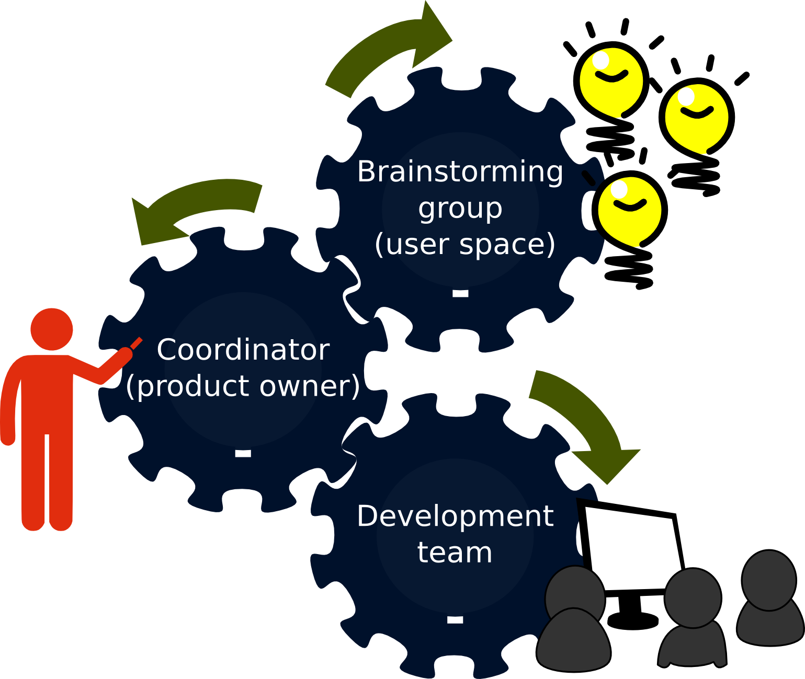
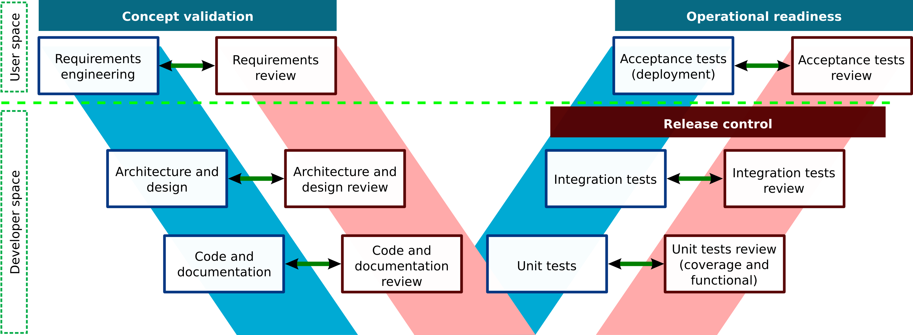

.. date: 19/04/2018
   author: Andre' Neto
   copyright: Copyright 2017 F4E | European Joint Undertaking for ITER and
   the Development of Fusion Energy ('Fusion for Energy').
   Licensed under the EUPL, Version 1.1 or - as soon they will be approved
   by the European Commission - subsequent versions of the EUPL (the "Licence")
   You may not use this work except in compliance with the Licence.
   You may obtain a copy of the Licence at: http://ec.europa.eu/idabc/eupl
   warning: Unless required by applicable law or agreed to in writing, 
   software distributed under the Licence is distributed on an "AS IS"
   basis, WITHOUT WARRANTIES OR CONDITIONS OF ANY KIND, either express
   or implied. See the Licence permissions and limitations under the Licence.

Quality Assurance
=================

The MARTe2 development process (core and components) respects a well defined QA process.

Project organisation
--------------------

One of the main objectives of the QA process is to enable a development which enables external contributions from a very heterogeneous community, without compromising the overall quality of the project.

The QA model comprises three main actors. The brainstorming group discusses and proposes requirements for MARTe. This group encompasses all the members from the community and any external people that which to contribute with ideas. 

The coordinator decides which requirements are feasible and relevant for the framework and integrates them into the developing documentation. Finally, the developing team designs and implements the software accordingly to these requirements. Notably the coding standard aims at demonstrating MISRA-C++:2008 compliance.
 

It should be noted that it is possible to share members between the brainstorming community in the development team, provided they strictly abide to the QA processes.

Software activities
-------------------

As shown in the figure below, he software activities are structured following a double-V-model approach where the first V (blue) is related to the development activities of the framework source-code and the second (red) implements the MARTe
quality assurance. The double-V emphasises the fact that each of the activities has its traceable mirror.

The process below is only mandatory for new releases of the framework but is usually setup for every feature development, as it greatly facilitates the QA of every new release.

Requirements
~~~~~~~~~~~~

The requirements activity translates the needs and objectives for MARTe, as defined by the stakeholders, into a proper set of  requirements. The output is one (or more) user-story in the `redmine issue tracking system <https://vcis-redmine.f4e.europa.eu/projects/marte2/>`_.

The architecture & design activity is driven from the requirements defined in the previous activity. The design includes a subset of classes considered the architectural foundation of the framework, complemented by any other classes which are needed for the framework to work. 

The review process verifies that the architecture and design are aligned with requirements and follow best practices. The relevant user-story is then updated with the QA result.

.. code-block:: ReST

   h1. Architecture & design review
   
   *Date of the review:* DD/MM/YYYY
   
   *Person who did the review:* Full name
   
   *Version of architecture & design document:* X.Y
   
   *Result of review:* [PASS|FAIL]
   
   *List of non-conformities:* (*)
   
   * Comment 1
   * Comment 2
   * ...
   * Comment N
   
   (*) Or write only "N/A" instead of a list if review passed without non-conformities.

Code and documentation review
~~~~~~~~~~~~~~~~~~~~~~~~~~~~~

In order to increase the robustness of the code and to avoid common errors and pitfalls, a controlled subset of the C++ language was defined for the MARTe framework. 

This subset is defined by means of a list of coding rules, which will address many of the dangerous aspects of the C++ language for critical systems. Thus, the C++ version used on MARTe is that defined by the standard ISO/IEC 14882:2003 (also known as C++03), while the coding rules are those defined by the standard MISRA C++:2008. 

The code and documentation review process includes the manual verification of the API documentation and the verification that a set of best practices were followed during the code implementation. 

This activity includes the execution of the ``flexelint`` static code analysis tool which verifies the compliance of the source code against the coding standard and in particular against the MISRA standard. 

For those rules which are not automatable, a manual review is performed before any major release.

The relevant user-story is updated as follows:

.. code-block:: ReST

   h1. Code and documentation review
   
   *Date of the review:* DD/MM/YYYY
   
   *Person who did the review:* Full name
   
   *Version of source code:* X.Y
   
   *Result of review:* [PASS|FAIL]
   
   *List of non-conformities:* (*)
   * Comment 1
   * Comment 2
   * Comment N
   (*) Or write only "N/A" instead of a list if review passed without non-conformities.
   

Unit and integration tests
~~~~~~~~~~~~~~~~~~~~~~~~~~

The unit test classes implicitly trace the implementation classes of the source code, because it is assumed that each unit test class tests only one implementation class. 

The review of the unit tests is divided in a static and in a dynamic analysis phase. In the former, the reviewer verifies how many public functions of the source code have unit tests defined (black box unit testing is assumed). 
The  latter, calculates what percentage of code has been executed (white/grey box unit testing is assumed). In both cases, code with low percentage coverage (< 80%) will be rejected.

The integration tests aim at exercising the architecture classes in the widest set of representative use-cases and are only applicable to vertical projects that make use the framework and that which to follow the same QA process.

The relevant user-story is updated as follows:

.. code-block:: ReST

   h1. Unit test review
   
   *Date of the review:* DD/MM/YYYY
   
   *Person who did the review:* Full name
   
   *Version of unit tests:* X.Y
   
   *Result of coverage tests review:* (including % of code covered)
   
   *Result of functional tests review:*
   
   *Result of review:* [PASS|FAIL]
   
   *List of non-conformities:* (*)
   * Comment 1
   * Comment 2
   * ...
   * Comment N
   (*) Or write only "N/A" instead of a list if review passed without non-conformities.
   

QA documentation
----------------

The QA formal documentation is available on the following documents:

======================================================================================================================= =====
Name                                                                                                                    Scope
======================================================================================================================= =====
:vcisgldocqa:`Coding standard <MARTe_Coding_Standard_32SNQE.pdf>`                                                       Coding rules applicable to the source code development in C++ (many of these can be :doc:`automated </contributing/development/environment/eclipse>`). 
:vcisgldocqa:`Configuration management <MARTe_Configuration_Management_Plan_2R5FL3.pfd>`                                Configuration management strategy. 
:vcisgldocqa:`Project management plan <MARTe_QA10_Project_Management_Plan_2RBL9F.pfd>`                                  How the development process is managed and organised.
:vcisgldocqa:`Project management plan <MARTe_QA40_Verification_and_Validation_Plan_3S94CT.pfd>`                         Framework verification and validation activities.
:vcisgldocqa:`Project management plan <MARTe_Quality_Assurance_Plan_2F888J.pfd>`                                        Establishes the process and procedures that are used to achieve the objectives of the quality assurance process.
======================================================================================================================= =====
