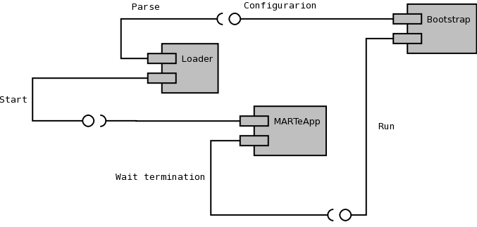

.. date: 30/04/2018
   author: Andre' Neto
   copyright: Copyright 2017 F4E | European Joint Undertaking for ITER and
   the Development of Fusion Energy ('Fusion for Energy').
   Licensed under the EUPL, Version 1.1 or - as soon they will be approved
   by the European Commission - subsequent versions of the EUPL (the "Licence")
   You may not use this work except in compliance with the Licence.
   You may obtain a copy of the Licence at: http://ec.europa.eu/idabc/eupl
   warning: Unless required by applicable law or agreed to in writing, 
   software distributed under the Licence is distributed on an "AS IS"
   basis, WITHOUT WARRANTIES OR CONDITIONS OF ANY KIND, either express
   or implied. See the Licence permissions and limitations under the Licence.

Kick-starting
=============

MARTe offers a generic application loader (see `MARTeApp.cpp <https://vcis-gitlab.f4e.europa.eu/aneto/MARTe2/blob/master/Source/App/MARTeApp.cpp>`_), that should be sufficiently generic for most use-cases.

The ``MARTeApp`` uses a portable :vcisdoxygencl:`Bootstrap` to read the input parameters and to setup the execution environment. The parameters expected by the Loaders (see the Configure method in :vcisdoxygencl:`Loader`) can be hard-coded in the application specific ``Bootstrap`` (embedded case) or can be read from the main ``argv`` parameters using the ``Bootstrap::ReadParameters`` method. With the configuration stream returned by the ``Bootstrap``, the :vcisdoxygencl:`Loader` is used by the ``MARTeApp`` to configure the application.

Upon a successful configuration, the ``MARTeApp`` calls the ``Loader::Start`` method. The standard implementation sends a Message to the destination specified in the configuration stream. The :vcisdoxygencl:`RealTimeLoader` implementation, configures the :doc:`RealTimeApplication </core/app/gams/rtappdetails>` (that is expected to exist in the configuration stream) and triggers the Start of the ``RealTimeApplication`` (either with a Message or by changing to a state specified in the configuration stream).
 
The :vcisdoxygencl:`Bootstrap` ``Run`` method is then expected to lock until the application is terminated, upon which the :vcisdoxygencl:`Loader` ``Stop`` method is called.

The MARTeApp is used in the MARTeApp.sh script (see :doc:`examples </core/examples>`):

.. literalinclude:: /_static/examples/MARTeApp.sh
   :language: bash
   :emphasize-lines: 79,98,100
   :caption: 
   :linenos: 
