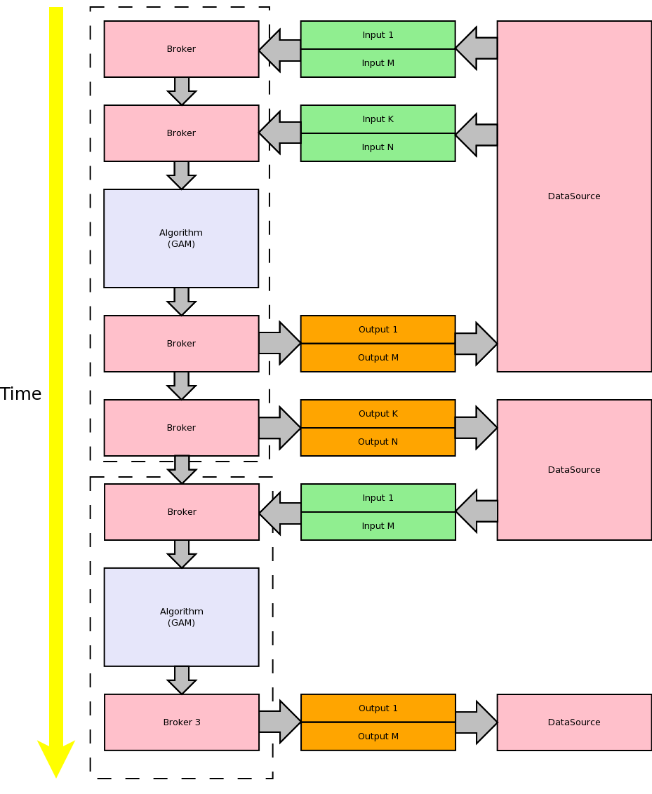
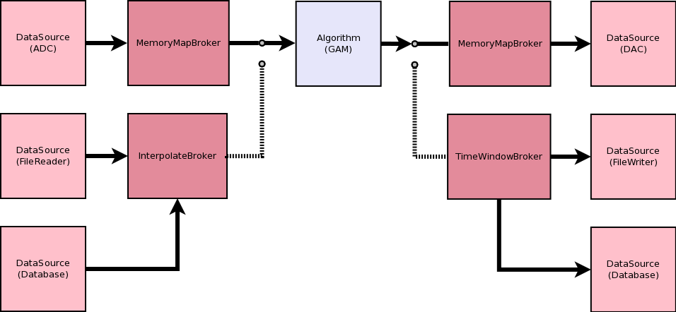
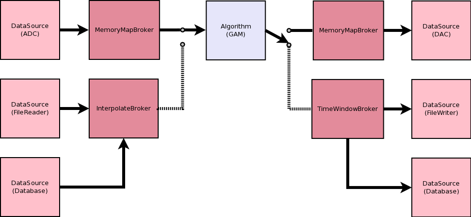
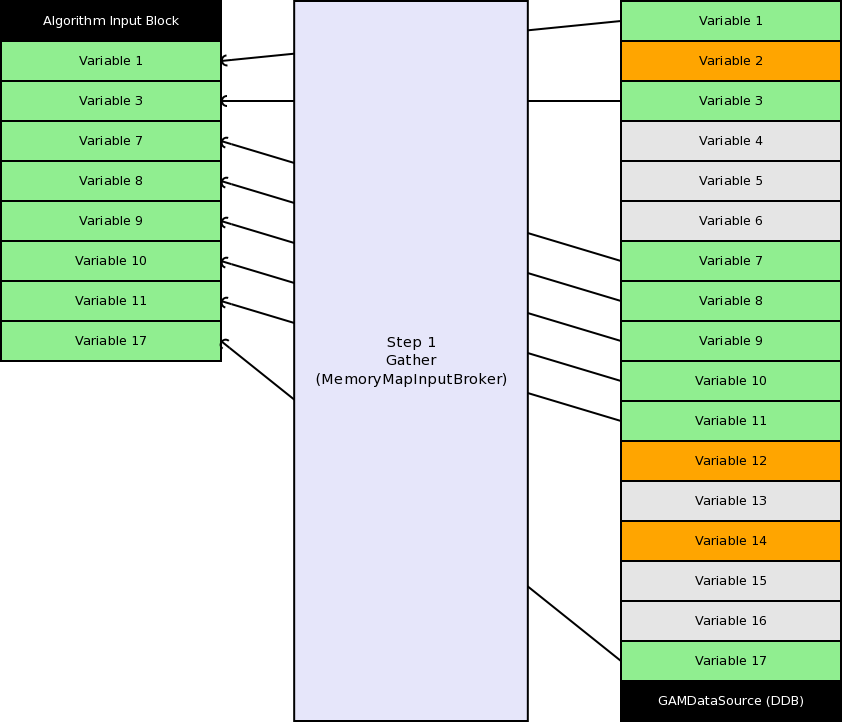
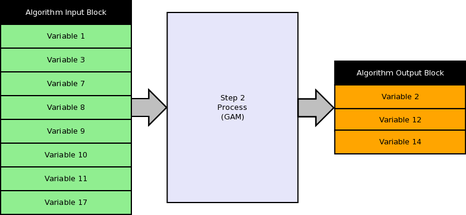

.. date: 11/04/2018
   author: Andre' Neto
   copyright: Copyright 2017 F4E | European Joint Undertaking for ITER and
   the Development of Fusion Energy ('Fusion for Energy').
   Licensed under the EUPL, Version 1.1 or - as soon they will be approved
   by the European Commission - subsequent versions of the EUPL (the "Licence")
   You may not use this work except in compliance with the Licence.
   You may obtain a copy of the Licence at: http://ec.europa.eu/idabc/eupl
   warning: Unless required by applicable law or agreed to in writing, 
   software distributed under the Licence is distributed on an "AS IS"
   basis, WITHOUT WARRANTIES OR CONDITIONS OF ANY KIND, either express
   or implied. See the Licence permissions and limitations under the Licence.

DataSource & Brokers
====================

Components inheriting from :vcisdoxygencl:`DataSourceI` provide a real-time interface for the interchange of input and output signals with the hardware.

.. image:: DataSource-1.png

Configuration
-------------

A DataSource is initialised just like any other :doc:`MARTe Object </core/configuration/objects>`.

.. code-block:: c++

    bool FileReader::Initialise(StructuredDataI& data) {
        //You must call DataSource::Initialise !
        bool ok = DataSourceI::Initialise(data);
        if (ok) {
            ok = data.Read("FileFormat", fileFormatStr);
        ...

The properties related to the DataSource signals are available when the ``SetConfiguredDatabase`` method is called. 

At this stage any of the signal related methods, described in the :vcisdoxygencl:`DataSourceI` API, can be used to query the available signal properties.

.. code-block:: c++

   bool FileReader::SetConfiguredDatabase (StructuredDataI & data) {
      //You must call DataSource::SetConfiguredDatabase !
      bool ok = DataSource::SetConfiguredDatabase (data);
      ...
      //Only one and one GAM allowed to interact with this DataSourceI
      ok = (GetNumberOfFunctions() == 1u);
      if (!ok) {
          REPORT_ERROR(ErrorManagement::ParametersError, "Exactly one Function allowed to interact with this DataSourceI");
      }
      ...
      uint32 nOfFunctionSignals = 0u;
      ok = GetFunctionNumberOfSignals(InputSignals, 0u, nOfFunctionSignals);
      ...

As in the case of the :doc:`GAMs </core/gams/gam>`, the DataSources can be conceptually divided in two sets: one where the signals (number, type and dimensions) are fixed by design (e.g. :vcisdoxygenmccl:`LinuxTimer`); and another where the behaviour of the hardware is adapted to the signal characteristics of a given real-time application (e.g. :vcisdoxygenmccl:`FileReader`). 

In the configuration stream the signals shall be placed inside a node named ``Signals``. 

The DataSourceI can also use :doc:`registered structured types </core/objects/introspection>` as input/output signals (the strategy is identical to the one described for the :doc:`GAMs </core/gams/gam>`). 

Signal properties
~~~~~~~~~~~~~~~~~

The signal name (in the context of the DataSource) is the name of the node. Other properties that can be set for any signal are:

==================== =======
Property             Meaning
==================== =======
Type                 The signal type as any of the supported :doc:`/core/types/types` or a structure type.
NumberOfElements     The number of elements (1 if the signal is a scalar).
NumberOfDimensions   The number of dimensions (0 if scalar, 1 if vector, 2 if matrix).
==================== =======  
   
Brokers
-------

The :vcisdoxygencl:`BrokerI` components provide the interface between the GAMs memory and the DataSource hardware data (typically memory).

The DataSource implementation will return the most appropriate Broker based **only** on the GAM signal properties (see ``DataSourceI::GetBrokerName`` to read the available properties):

.. code-block:: c++
   
   //This function will be called for every signal that interacts with this DataSource.
   const char8* LinuxTimer::GetBrokerName(StructuredDataI& data, const SignalDirection direction) {
       const char8 *brokerName = NULL_PTR(const char8 *);
       if (direction == InputSignals) {
           float32 frequency = 0.F;
           //Read the signal property
           if (!data.Read("Frequency", frequency)) {
               frequency = -1.F;
           }
           //Depending on the property select the type of Broker
           if (frequency > 0.F) {
               brokerName = "MemoryMapSynchronisedInputBroker";
               synchronising = true;
           }
           else {
               brokerName = "MemoryMapInputBroker";
       }    
    ...
    return brokerName;

Before the Execute method of the GAM is called, all the Brokers that provide input data to the GAM are executed, so that the GAM has all the required input data ready before executing its algorithm. 

Conversely, after the GAM finishes its execution, all the Brokers that read data from the GAM (and write to a given DataSource) are executed.

Returning Input and Output Brokers
----------------------------------
 
The DataSourceI will have to instantiate and return the appropriate brokers, depending on the signal type. The name of the broker returned in the ``GetBrokerName`` method shall be consistent with the class type of the Brokers that are added in the ``GetInputBrokers`` and ``GetOutputBrokers``.

.. code-block:: c++
   
   bool LinuxTimer::GetInputBrokers(ReferenceContainer& inputBrokers, const char8* const functionName, void* const gamMemPtr) {
       bool ok = GetFunctionIndex(functionIdx, functionName);
       if ((synchronising) && (synchronisingFunctionIdx == functionIdx)) {
           ReferenceT<MemoryMapSynchronisedInputBroker> brokerSync("MemoryMapSynchronisedInputBroker");
           ...
           if (ok) {
               //This call will only add the Synchronous signal (given that GetBrokerName returned MemoryMapSynchronisedInputBroker at most for one signal)
               ok = brokerSync->Init(InputSignals, *this, functionName, gamMemPtr);
            ...
            if (ok) {
                ok = inputBrokers.Insert(brokerSync);
           ...
       else {
           ReferenceT<MemoryMapInputBroker> broker("MemoryMapInputBroker");
           ok = broker.IsValid();
           if (ok) {
               ok = broker->Init(InputSignals, *this, functionName, gamMemPtr);
           ...
           if (ok) {
               ok = inputBrokers.Insert(broker);
           ...

A Broker may be specifically developed for a given DataSource (e.g. because the Broker needs to access an hardware dependent function) or one of the MARTe standard brokers may be used:

============================================================= ===========
Name Description
============================================================= ===========
:vcisdoxygencl:`MemoryMapInputBroker`                         Copies the signals from a memory area declared in the DataSource.
:vcisdoxygencl:`MemoryMapInperpolatedInputBroker`             Interpolates the signals from the DataSource.
:vcisdoxygencl:`MemoryMapMultiBufferBroker`                   Copy from/to a DataSourceI multi-buffer memory address. A different buffer is allocated for each signal.  
:vcisdoxygencl:`MemoryMapMultiBufferInputBroker`              Input version of the MemoryMapMultiBufferBroker.
:vcisdoxygencl:`MemoryMapMultiBufferOutputBroker`             Output version of the MemoryMapMultiBufferBroker.
:vcisdoxygencl:`MemoryMapOutputBroker`                        Copies the signals to a memory area declared in the DataSource.
:vcisdoxygencl:`MemoryMapSynchronisedInputBroker`             Calls the ``Synchronise`` method on the DataSource before copying the signals.
:vcisdoxygencl:`MemoryMapSynchronisedMultiBufferInputBroker`  Synchronised input implementation of the MemoryMapMultiBufferBroker.
:vcisdoxygencl:`MemoryMapSynchronisedMultiBufferOutputBroker` Synchronised output implementation of the MemoryMapMultiBufferBroker.
:vcisdoxygencl:`MemoryMapSynchronisedOutputBroker`            Calls the ``Synchronise`` method on the DataSource after copying the signals.
:vcisdoxygencl:`MemoryMapAsyncOutputBroker`                   Asynchronously (i.e. in the context of another, decoupled, thread) calls the ``Synchronise`` method on the DataSource after copying the signals into a circular buffer.
:vcisdoxygencl:`MemoryMapAsyncTriggerOutputBroker`            Only stores data based on an event trigger (with pre and post windows). Asynchronously (i.e. in the context of another, decoupled, thread) calls the ``Synchronise`` method on the DataSource after copying the signals into a circular buffer.
============================================================= ===========

The memory map based brokers access the DataSource memory using the ``DataSourceI::GetSignalMemoryBuffer``.

All the functions which are related to data transformation should be implemented in a Broker. This allows to reuse the same Broker class in different DataSource implementations (e.g. the :vcisdoxygencl:`MemoryMapInperpolatedInputBroker` can be reused on any DataSourceI which requires data interpolation).

In the example below, the interpolation and the time window brokers are reused in different hardware interfaces.  

   
   A GAM can be fed with data from different sources.

.. figure:: Brokers-3.png
   
   The same interpolation Broker is reused by the File and the Database Datasources. 

   The same time window Broker is reused by the File and the Database Datasources.

Broker synchronisation
----------------------

All the Brokers implement the :vcisdoxygencl:`ExecutableI` interface and are thus scheduled by the application scheduler.

As discussed above, their main function is to copy the data from/to the GAM memory, but they can also be used as a synchronisation point: either by blocking the execution until new data is available; or by triggering the output when data is written.

Examples of synchronisation brokers are the :vcisdoxygencl:`MemoryMapSynchronisedInputBroker` and the :vcisdoxygencl:`MemoryMapSynchronisedOutputBroker`.

.. code-block:: c++
   
   //Function called by the MemoryMapSynchronisedInputBroker before copying the data from the data source memory.
   bool LinuxTimer::Synchronise() {
       ...
       //Block execution until an event occurs
       err = synchSem.ResetWait(TTInfiniteWait);
       ...

Asynchronous brokers are expected to provide unblocking data (i.e. as soon as the broker asks for it). This data is typically made available by another thread.

.. warning::

   If the synchronisation requires interfacing with the operating system, a decoupling thread shall be used. This allows to decouple the real-time thread performance and to handle possible timeouts. The :vcisdoxygencl:`MemoryMapAsyncOutputBroker` is an example of such type of Broker.

GAMDataSource (DDB)
-------------------

The :vcisdoxygencl:`GAMDataSource` (also known as DDB) is a framework standard DataSource component for the real-time interchange of data between GAMs that belong to the same :vcisdoxygencl:`RealTimeThread`.

The DDB is based on a non-blocking (i.e. without any synchronisation) scatter and gather mechanism. 

First the data is copied (gather) to the GAM input signal memory... 

...then is processed by the GAM ...

...and finally the data is scattered back to the DDB:

.. figure:: GAMDataSource-3.png

MemoryDataSourceI
-----------------

The :vcisdoxygencl:`MemoryDataSourceI` can be used as a base class to develop data sources which require a memory map (eventually multi-buffer) implementation.

The :vcisdoxygenmccl:`RealTimeThreadAsyncBridge` is an example of a :vcisdoxygencl:`MemoryDataSourceI` implementation.

CircularBufferThreadInputDataSource
-----------------------------------

The :vcisdoxygencl:`CircularBufferThreadInputDataSource` can be used as a base class for data sources which require a circular buffer interface to the underlying data. This abstract class already offers all the circular buffer implementation and the threading mechanisms that allows to decouple the access to the data from the real-time thread interface. 

The TODO is an example of a :vcisdoxygencl:`CircularBufferThreadInputDataSource` implementation.

Examples
--------

The following is an example which uses 4 distinct DataSources. Note that the signals will be automatically added to the GAMDataSource and to the LoggerDataSource, based on the GAM *requests*.

.. literalinclude:: /_static/examples/Configurations/GAMs-1.cfg
   :language: bash	
   :caption: Fixed signals configuration (Run with NAME_OF_THE_STATE=State1 and NAME_OF_THE_CONFIGURATION_FILE=GAMs-1.cfg)
   :linenos:
   :emphasize-lines: 72-92

Instructions on how to compile and execute the examples can be found :doc:`here </core/examples>`.
