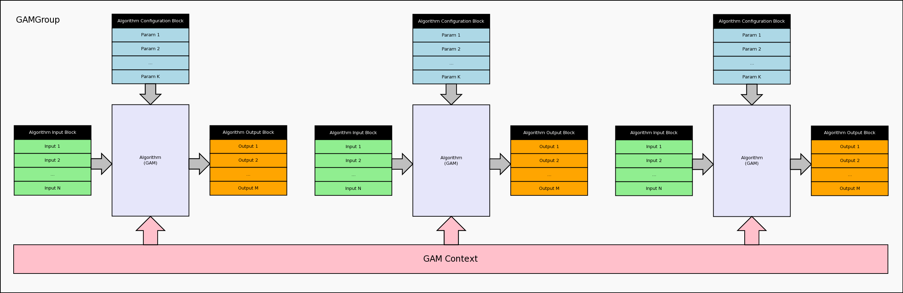

.. date: 06/04/2018
   author: Andre' Neto
   copyright: Copyright 2017 F4E | European Joint Undertaking for ITER and
   the Development of Fusion Energy ('Fusion for Energy').
   Licensed under the EUPL, Version 1.1 or - as soon they will be approved
   by the European Commission - subsequent versions of the EUPL (the "Licence")
   You may not use this work except in compliance with the Licence.
   You may obtain a copy of the Licence at: http://ec.europa.eu/idabc/eupl
   warning: Unless required by applicable law or agreed to in writing, 
   software distributed under the Licence is distributed on an "AS IS"
   basis, WITHOUT WARRANTIES OR CONDITIONS OF ANY KIND, either express
   or implied. See the Licence permissions and limitations under the Licence.

GAM
===

The Generic Application Module (:vcisdoxygencl:`GAM`) is the component where user-algorithms are to be implemented.

The GAM offers one interface for configuration and two interfaces for real-time input and output processing.

.. image:: GAM-1.png

.. warning::
   No interface with operating system (e.g. reading from files/sockets) shall be implemented in the GAMs. The only exception is memory allocation during configuration.   

GAMs can be conceptually divided in two sets: one where the inputs and outputs signals (number, type and dimensions) are fixed by design; and another where the algorithm behaviour varies with the signal characteristics of a given real-time application (see examples below).  

Configuration
-------------

A GAM is initialised just like any other :doc:`MARTe Object </core/configuration/objects>`.

The properties related to the input and output signals are available when the ``Setup`` method is called. At this stage any of the signal related methods described in the GAM API can be used to query the signal properties.

.. code-block:: c++   

   virtual bool MyGAM::Setup () {
      ...
      uint32 numberOfInputSignals = GetNumberOfInputSignals();
      ...
      for (i = 0u; i<numberOfInputSignals; i++) {
         TypeDescriptor td = GetSignalType(InputSignals, i);
         ...
      }
      ...
   }

Typical use cases of the Setup method are to validate and/or configure the algorithm against the input/output signal requirements of the specific application (e.g. the number, type and dimensions);   

.. code-block:: c++   

   virtual bool MyGAM::Setup () {
      ...
      uint32 numberOfInputSignals = GetNumberOfInputSignals();
      ...
      //Only accept one input signal
      bool ok = (numberOfInputSignals == 1u);
      ...
   }
   
In the configuration stream the input signals shall be placed inside a node named ``InputSignals`` and the output signals inside a node named ``OutputSignals``. 

.. code-block:: c++   

   ...
   InputSignals = {
      Counter = {
         DataSource = DDB1
         Type = uint32
      }                
   }
   OutputSignals = {
      GainCounter = {
         DataSource = DDB1
         Type = uint32
      }                
   }
   ...

GAMs can also use :doc:`registered structured types </core/objects/introspection>` as input/output signals. 

For example, the following structure can be used as a signal:

.. code-block:: c++

   struct ModelGAMExampleStructInner1 {
      MARTe::float32 f1;
      MARTe::float32 f2;
      MARTe::float32 f3[6];
   };
   struct ModelGAMExampleStructSignal {
      MARTe::uint32 u1;
      ModelGAMExampleStructInner1 s1;
      ModelGAMExampleStructInner1 s2;
   };

.. code-block:: c++   

   ...
   InputSignals = {
      Signal1 = {
         DataSource = DDB1
         Type = ModelGAMExampleStructSignal
      }                
   }
   OutputSignals = {
      Signal1 = {
         DataSource = DDB1
         Type = ModelGAMExampleStructSignal
      }                
   }
   ...

Note that the structure will be automatically expanded into the equivalent configuration structure (this means that the :vcisdoxygencl:`GAM` API will *see* the expanded structure):

.. code-block:: c++   

   ...
   InputSignals = {
      Signal1 = {
         u1 = {
            DataSource = DDB1
            Type = uint32
         }
         s1 = {
            f1 = {
               DataSource = DDB1
               Type = float32
            }
            f2 = {
               DataSource = DDB1
               Type = float32
            }
            f3 = {
               DataSource = DDB1
               Type = float32
               NumberOfDimensions = 1
               NumberOfElements = 6
            }
         }
         s2 = {
            ...
         }
      }                
   }   
   ...

Signal properties
~~~~~~~~~~~~~~~~~

The signal name (in the context of the GAM) is the name of the node. Other properties that can be set for any signal are:

==================== =======
Property             Meaning
==================== =======
Type                 The signal type as any of the supported :doc:`/core/types/types` or a structure type.
DataSource           The name of the DataSource from where the signal will read/written from/to.
Frequency            Only meaningful for input signals. The frequency at which the signal is expected to be produced (at most one signal per real-time thread) may have this property set.
Trigger              Only meaningful for output signals. Trigger the DataSource when this signal is written.
NumberOfElements     The number of elements (1 if the signal is a scalar).
NumberOfDimensions   The number of dimensions (0 if scalar, 1 if vector, 2 if matrix).
Samples              The number of samples to read from a DataSource.  This number defines the number of samples that the DataSource shall acquire for each control cycle. Note that each sample may contain an array. Indeed, the amount of memory required to hold a signal of type T, with M samples and N elements is: sizeof(T) x M x N. Typical use cases: i) ADC: M samples, 1 element; ii) Image: 1 sample, N elements; iii) Video: M samples, N elements.   
Ranges               In the case of a vector read/write only a subset. The format is a matrix, indexed to zero, of the ranges that are to be read (e.g. ``{{0, 1}, {3, 5}}`` would read elements 0, 1, 3, 4 and 5 of the array).
Alias                The name of the signal in the DataSource (which can be different from the name of the signal in the GAM).
Default              The default value to be used in the first control cycle (if needed, i.e. if it depends from a value of the previous cycle).
==================== =======  

The structure types offer to extra properties:

==================== =======
Property             Meaning
==================== =======
MemberAliases        The name of the structured member signal in the DataSource (which can be different from the name of the signal in the GAM).
Defaults             The default value for a given member of the structure.
==================== =======  

The following snippet shows how to change the alias and the defaults of a structure. 

.. code-block:: c++   

   ...
   InputSignals = {
      Signal1 = {
         DataSource = DDB1
         Type = ModelGAMExampleStructSignal
         Defaults = {
            Signal1.s1.f1 = 2
            Signal1.s1.f2 = 3
            Signal1.s1.f3 = {1, 2, 3, 4, 5, 6}
            Signal1.s2.f1 = -2
            Signal1.s2.f2 = -3
            Signal1.s2.f3 = {-1, -2, -3, -4, -5, -6}
         }
         MemberAliases = {
            //Rename of a structured member
            Signal1.s2.f2 = Signal1.s2.g2
         }
      }                
   ...
   
   
Real-time execution
-------------------

The ``Execute`` method is called at every real-time cycle. 

When the method is called, the input signals will be ready to be processed by the GAM. After the method is called the output signals will be propagated accordingly. 

.. code-block:: c++   

   ...
   bool GAM1::Setup() {
   ...
      inputSignal = reinterpret_cast<uint32 *>(GetInputSignalMemory(0u));
      outputSignal = reinterpret_cast<uint32 *>(GetOutputSignalMemory(0u));
   ...
   
   bool GAM1::Execute() {
   ...
      *outputSignal = gain * *inputSignal;
   ...

GAMGroup
--------

GAMs can also be grouped into a context where a set of constant data is shared between them. 

Typical use-cases for GAMGroups are the need to share initialisation data which is either onerous to compute or that requires the storing of a large amount of memory. In both cases it would be a waste of resources to repeat and store the same initialisation process on all the GAMs requiring access to this information. 

The shared context is set by calling the method ``GAMGroup::SetContext`` in the class inheriting from :vcisdoxygencl:`GAMGroup`. This will then trigger the calling of the method ``SetContext`` on all the :vcisdoxygencl:`GAM` components that, in the configuration stream, are a child of this GAMGroup instance. 

.. code-block:: c++

   ...
   +GAMGroup1 = {
      Class = ParentGAMGroupExample1
      //The model to be shared by all the GAMs belonging to this group
      Model = {{2, 0, 0}, {0, 3, 0}, {1, 0, 4}}
      +GAMChild1 = {
         Class = ChildGAMGroupExample1
         ...
      } 
      +GAMChild2 = {
         Class = ChildGAMGroupExample2
		 ...
      }
      ...
      
.. code-block:: c++

   ...
   class ParentGAMGroupExample1: public MARTe::GAMGroup {
   ...
      bool PrepareNextState(const MARTe::char8*, const MARTe::char8*) {
         ...
         ok = SetContext(matrixModelContext);
         	...
      
   class ChildGAMGroupExample1 : public MARTe::GAM {
      ...
      bool SetContext(ConstReference context) {
         matrixModelContext = context;
         contextSet = context.IsValid();
      ...
      
Examples
--------

Fixed GAM
~~~~~~~~~

The following is an example of GAM which has a fixed number of signals. 

.. literalinclude:: /_static/examples/Core/FixedGAMExample1.cpp
   :language: c++   
   :caption: Fixed signals GAM (FixedGAMExample1)
   :linenos:
   :emphasize-lines: 72,84,101,120,139,156-157,164
   
.. literalinclude:: /_static/examples/Configurations/GAMs-1.cfg
   :language: bash	
   :caption: Fixed signals configuration (Run with NAME_OF_THE_STATE=State1 and NAME_OF_THE_CONFIGURATION_FILE=GAMs-1.cfg)
   :linenos:
   :emphasize-lines: 29-44
   
Variable GAM
~~~~~~~~~~~~

The following is an example of GAM which adapts to the number of output signals. 

.. literalinclude:: /_static/examples/Core/VariableGAMExample1.cpp
   :language: c++   
   :caption: Variable signals GAM (VariableGAMExample1)
   :linenos:
   :emphasize-lines: 82,99,106,113,118,121,137,140,157,160,177,180,194,198,206-207
   
.. literalinclude:: /_static/examples/Configurations/GAMs-2.cfg
   :language: bash	
   :caption: Variable signals configuration (Run with NAME_OF_THE_STATE=State1 and NAME_OF_THE_CONFIGURATION_FILE=GAMs-2.cfg)
   :linenos:
   :emphasize-lines: 29-68
     
Structure GAM
~~~~~~~~~~~~~

The following is an example of GAM which uses a (registered) structured signal in input and output.

.. literalinclude:: /_static/examples/Core/ModelGAMExample1.cpp
   :language: c++   
   :caption: Structured signal GAM (ModelGAMExample1)
   :linenos:
   :emphasize-lines: 39-55,140,151,161,173,176,185,194,206,215,218,224-242
   
.. literalinclude:: /_static/examples/Configurations/GAMs-3.cfg
   :language: bash	
   :caption: Structured signals configuration (Run with NAME_OF_THE_STATE=State1 and NAME_OF_THE_CONFIGURATION_FILE=GAMs-3.cfg)
   :linenos:
   :emphasize-lines: 34-45,51-54,67,72,121-122

GAMGroup
~~~~~~~~

The following is an example of GAMGroup which shares a Matrix with several GAMs.

.. literalinclude:: /_static/examples/Core/ParentGAMGroupExample1.cpp
   :language: c++   
   :caption: Parent GAMGroup which shares a Matrix with the ChildGAMGroupExample1 and ChildGAMGroupExample2 instances.
   :linenos:
   :emphasize-lines: 66
   
.. literalinclude:: /_static/examples/Core/ChildGAMGroupExample1.cpp
   :language: c++   
   :caption: Child GAMGroup which shares a Matrix with the ParentGAMGroupExample1 instance.
   :linenos:
   :emphasize-lines: 127,130-131,142,164

.. literalinclude:: /_static/examples/Core/ChildGAMGroupExample2.cpp
   :language: c++   
   :caption: Child GAMGroup which shares a Matrix with the ParentGAMGroupExample1 instance.
   :linenos:
   :emphasize-lines: 131,134-135,146,160,169-170
      
.. literalinclude:: /_static/examples/Configurations/GAMs-4.cfg
   :language: bash	
   :caption: GAMGroup example (Run with NAME_OF_THE_STATE=State1 and NAME_OF_THE_CONFIGURATION_FILE=GAMs-4.cfg)
   :linenos:
   :emphasize-lines: 45-47,198

   
Instructions on how to compile and execute the examples can be found :doc:`here </core/examples>`.
