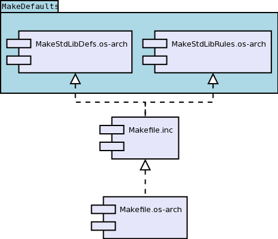

.. date: 26/03/2018
   author: Andre' Neto
   copyright: Copyright 2017 F4E | European Joint Undertaking for ITER and
   the Development of Fusion Energy ('Fusion for Energy').
   Licensed under the EUPL, Version 1.1 or - as soon they will be approved
   by the European Commission - subsequent versions of the EUPL (the "Licence")
   You may not use this work except in compliance with the Licence.
   You may obtain a copy of the Licence at: http://ec.europa.eu/idabc/eupl
   warning: Unless required by applicable law or agreed to in writing, 
   software distributed under the Licence is distributed on an "AS IS"
   basis, WITHOUT WARRANTIES OR CONDITIONS OF ANY KIND, either express
   or implied. See the Licence permissions and limitations under the Licence.

Makefile
========

The preferred way  (compulsory if you are contributing to the core of the library) to build MARTe2 based projects is to follow the MARTe2 Makefile structure.

All the Makefiles share a common Makefile.inc which in turn imports the main definitions from the operating system and architecture `MakeDefaults <https://vcis-gitlab.f4e.europa.eu/aneto/MARTe2/tree/master/MakeDefaults>`_.

The definitions and the Makefile rules for the selected operating system and architecture will have to exist in the `MakeDefaults <https://vcis-gitlab.f4e.europa.eu/aneto/MARTe2/tree/master/MakeDefaults>`_ folder.

The Makefile.inc defines all the rules that are common to all the operating systems and architecture. The Makefile.\ **os-arch** (where **os.arch** is the selected operating systems/architecture) shall include, as a minimum, the Makefile.inc and shall define the ``TARGET`` operating system/architecture.  

.. code-block:: makefile
   
   TARGET=os-arch
   include Makefile.inc

Where **os-arch** is the selected operating systems/architecture.

As an example, a Makefile to compile for linux on an armv8 (i.e. ``Makefile.armv8-linux``) could look like:

.. code-block:: makefile
   
   TARGET=armv8-linux
   include Makefile.inc
   #Example of an operating system/architecture specific flag
   LIBRARIES += -lm

Definitions
-----------

The following are definitions from the MakeDefaults/MakeStdLibDefs.\ **os-arch** file and may be either complemented or overridden by a project specific Makefile.inc or by a project specific Makefile.\ **os-arch**.  

================ ==========
Acronym          Definition
================ ==========
ARCHITECTURE     The architecture being compiled (e.g. x86_gcc).
BUILD_DIR        Default location where the compiled output files are written into. The default rule is: ``$(ROOT_DIR)/Build/$(TARGET)/$(PACKAGE)/DIR_NAME``, where DIR_NAME is the name of the directory where the source files are being compiled. 
CFLAGS           Compiler flags specific to **C** unit files (e.g. -fPIC).
CPPFLAGS         Compiler flags specific to **C++** unit files (e.g. -frtti).
DEBUG            Debug related flags (e.g. -g).
ENVIRONMENT      The operating system environment being compiled (e.g. Linux).
INCLUDES         Folders to be included during the compilation process.
LIBRARIES        Shared libraries to be used during the linking process (e.g. -lm).
LIBRARIES_STATIC Static libraries to be used during the linking process.
MAKEDEFAULTDIR   The location of the MakeDefault directory.
PACKAGE          Name of the package to which the output belongs to (can be overriden by BUILD_DIR).
OBJSX            List of unit files to be compiled. The format is NAME_OF_FILE.x
OPTIM            Optimisation related flags (e.g. -O2)
ROOT_DIR         Location of the Build directory  (can be overriden by BUILD_DIR).
SPB              List of other subfolders to be compiled. The format is NAME_OF_FOLDER.x 
================ ========== 

Supported outputs
-----------------

The Makefile.inc also defines the type of outputs that are to be produced. The following outputs are supported.

======= ==========
Acronym Definition
======= ==========
ASMEXT  Assembly file.
DLLEXT  Shared library.
DRVEXT  Driver file.
EXEEXT  Executable.
GAMEXT  GAM file.
LIBEXT  Static library.
OBJEXT  Object file.
======= ========== 

An example of Makefile.inc file is:

.. code-block:: makefile
   
   #List of objects to be compiled
   OBJSX=File1.x \
   	File2.x \
   	File3.x

   #Name of the package (see the Definitions above)
   PACKAGE=Components/Examples

   #Where is the Build directory
   ROOT_DIR=../../../../   
   
   #Compulsory. Defines the location of the MakeDefaults directory. MARTe2_DIR is the location where MARTe2 is installed.
   MAKEDEFAULTDIR=$(MARTe2_DIR)/MakeDefaults
   include $(MAKEDEFAULTDIR)/MakeStdLibDefs.$(TARGET)

   #List of folders to be included
   INCLUDES += -I.
   INCLUDES += -I$(MARTe2_DIR)/Source/Core/BareMetal/L0Types
   INCLUDES += -I$(MARTe2_DIR)/Source/Core/BareMetal/L1Portability
   INCLUDES += -I$(MARTe2_DIR)/Source/Core/BareMetal/L2Objects
   INCLUDES += -I$(MARTe2_DIR)/Source/Core/BareMetal/L3Streams
   INCLUDES += -I$(MARTe2_DIR)/Source/Core/BareMetal/L4Messages
   INCLUDES += -I$(MARTe2_DIR)/Source/Core/BareMetal/L4Configuration
   INCLUDES += -I$(MARTe2_DIR)/Source/Core/BareMetal/L5GAMs
   INCLUDES += -I$(MARTe2_DIR)/Source/Core/Scheduler/L1Portability
   INCLUDES += -I$(MARTe2_DIR)/Source/Core/Scheduler/L3Services
   INCLUDES += -I$(MARTe2_DIR)/Source/Core/Scheduler/L4Messages

   #Outputs to be generated: a static library and a shared library in this example
   all: $(OBJS) $(SUBPROJ) \
      $(BUILD_DIR)/MYLIB1$(LIBEXT) \
      $(BUILD_DIR)/MYLIB1$(DLLEXT)
	     echo  $(OBJS)

   include $(MAKEDEFAULTDIR)/MakeStdLibRules.$(TARGET)

Note that if the output file is also a unit file (i.e. if a .c or .cpp also exist) it shall not be declared in the OBJSX section (see example below).

In the case of executables and shared libraries, a unit file with the name of the output file shall exist (i.e. if an executable named Main.ex is to be created, a file named Main.cpp shall exist).

Nested compilation
------------------

Using the ``SPB`` definition the Makefile will compile several folders in the provided sequence.

For example, the instruction ``SPB=FOLDER1.x FOLDER2/FOLDER3.x`` would trigger the compilation in FOLDER1 and in FOLDER2/FOLDER3. 

Note that inside each of these folders a Makefile.inc and one, or more, Makefile.\ **os-arch** files will have to exist. 

Example
-------

The following example builds a library using the files File1.cpp and File2.cpp. Note that the File1.cpp is not included in the OBJSX since it is also the name of the executable to be generated.  

.. literalinclude:: /_static/examples/Makefiles/Makefile.inc
   :language: makefile
   :emphasize-lines: 26,29,32,37,59
   :caption: Makefile.inc
   :linenos:

.. literalinclude:: /_static/examples/Makefiles/Makefile.linux
   :language: makefile
   :emphasize-lines: 27,32
   :caption: Makefile.linux
   :linenos:
   
To try the example execute:

.. code-block:: bash
   
   export MARTe2_DIR=FOLDER_WHERE_MARTe2_IS_INSTALLED
   cd $MARTe2_DIR/Docs/User/source/_static/examples/Makefiles
   make -f Makefile.linux
   export LD_LIBRARY_PATH=$LD_LIBRARY_PATH:$MARTe2_DIR/Build/linux/Core/
   ../../../../../../Build/linux/Examples/Makefiles/ExFile1.ex
   