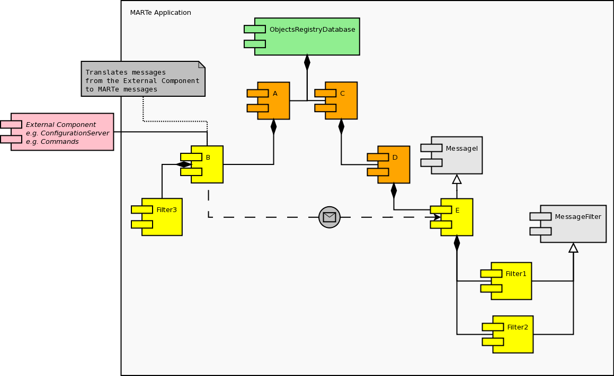
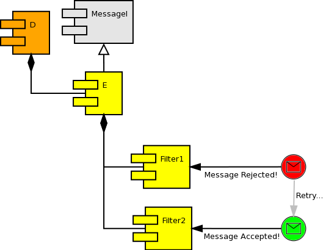
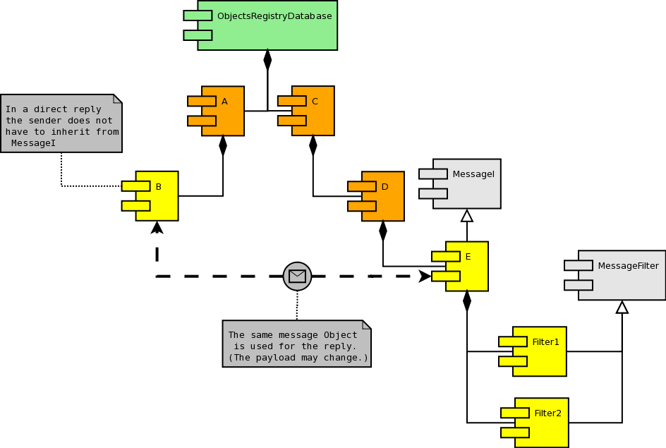
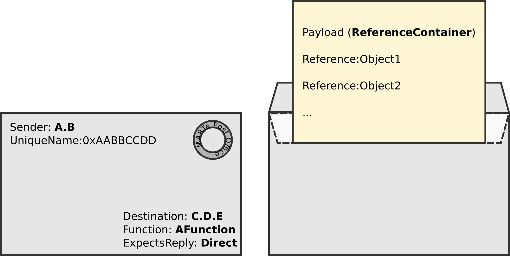
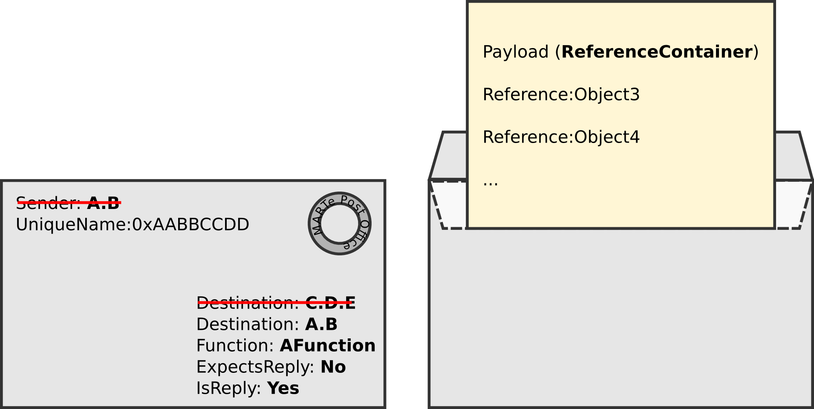
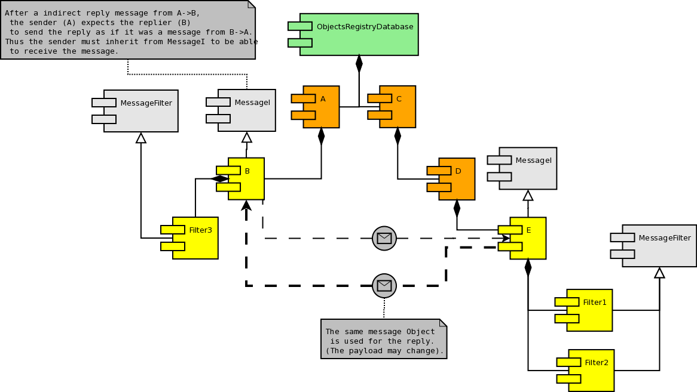

.. date: 17/04/2018
   author: Andre' Neto
   copyright: Copyright 2017 F4E | European Joint Undertaking for ITER and
   the Development of Fusion Energy ('Fusion for Energy').
   Licensed under the EUPL, Version 1.1 or - as soon they will be approved
   by the European Commission - subsequent versions of the EUPL (the "Licence")
   You may not use this work except in compliance with the Licence.
   You may obtain a copy of the Licence at: http://ec.europa.eu/idabc/eupl
   warning: Unless required by applicable law or agreed to in writing, 
   software distributed under the Licence is distributed on an "AS IS"
   basis, WITHOUT WARRANTIES OR CONDITIONS OF ANY KIND, either express
   or implied. See the Licence permissions and limitations under the Licence.

Messages
========

The MARTe messaging mechanism allows components to exchange information and commands based on the Objects addresses (source and destination) in the :vcisdoxygencl:`ObjectRegistryDatabase`.

Messages enable to change the behaviour of an application based only on configuration data, i.e. without requiring any code recompilation.

Messages also provide a generic interface between MARTe components and any components and protocols that live outside a MARTe application. This allows, for instance, to replace an external component without changing the internal message protocol.

This interface is typically used for non real-time activities, such as configuration and state management. In particular, messages are the main technology behind the :doc:`StateMachine </core/statemachine/statemachine>` 

The main actors are the :vcisdoxygencl:`Message` and the :vcisdoxygencl:`MessageI` components. The former defines the payload, the sender and the destination of the message. The latter is the interface that allows to receive messages. 

Message
-------

The :vcisdoxygencl:`Message` requires the definition of the following parameters:

- Sender: the Object that is sending the message;
- Destination: the Object that will receive the message;
- Function: a string which identifies the scope of the action to be performed in the Destination object;
- IsReply: true if this message is a reply to a previous message;
- ExpectsReply: true if a reply is expected from the Destination component.

.. image:: Messages-1.png

Given that the Message is also a :vcisdoxygencl:`ReferenceContainer` the payload is defined by the References that are inserted into the container.
 
MessageI
--------

In order to be able to receive messages a component shall inherit from :vcisdoxygencl:`MessageI` and shall register one or more filters that will be responsible for deciding if a given message is to be accepted.

Filters shall inherit from :vcisdoxygencl:`MessageFilter` and can be either permanent or temporary. A temporary filter will be removed from the :vcisdoxygencl:`MessageI` after accepting the first message. 

.. code-block:: c++

   class MessageFilterEx1: public MARTe::Object, public MARTe::MessageFilter {
      ...
      //Permanent filter => MessageFilter(true) 
      MessageFilterEx1 () : MARTe::Object(), MARTe::MessageFilter(true) {
      }
      
      virtual MARTe::ErrorManagement::ErrorType ConsumeMessage(MARTe::ReferenceT<MARTe::Message> &messageToTest) {
         //Check if this filter is appropriate to handle the message
      }

.. code-block:: c++

   class MessageEx1: public MARTe::Object, public MARTe::MessageI {
      ... 
      MessageEx1 () : MARTe::Object(), MARTe::MessageI() {
        filter = ReferenceT<MessageFilterEx1>(GlobalObjectsDatabase::Instance()->GetStandardHeap());
        filter->SetOwner(this);
        //Install the filter
        ErrorManagement::ErrorType ret = MessageI::InstallMessageFilter(filter);
    }

.. image:: Messages-2.png

A Message is sent by calling the function ``MessageI::SendMessage`` and may be called in any context and from any component (even if it does not inherit from Object).

.. code-block:: c++

   ...
   ErrorManagement::ErrorType err = MessageI::SendMessage(msg, this);
   ...
   

Replies
-------

The reply to a message can be either *direct* or *indirect*. In both cases the **same** Message instance is used for the reply. The replier is allowed to change the payload as needed.

In the case of a *direct* reply, the sender waits (polls) for the Message instance to change from ``IsReply() == false`` to ``IsReply() == true``. As such, the message sender does not have to inherit from ``MessageI``. The only requirement is that it inherits from Object.

Original message instance ...

... is changed to update the ``Destination`` field to the original sender (note that IsReply() is now true).
	

.. code-block:: c++

   ...
   //This function will poll and wait for msg->IsReply() to be changed to true
   err = MessageI::SendMessageAndWaitReply(msg, this);
   ...

Conversely, *indirect* replies require the sender to inherit from ``MessageI``. The reason is that *indirect* replies are treated as a normal message, but sent back from the replier to the sender. 

.. image:: Messages-4A.png

*Indirect* replies can be used, for instance, to implement asynchronous message exchanging, allowing, for example, to wait for the reply in the context of a different thread (e.g. by using a :vcisdoxygencl:`QueuedReplyMessageCatcherFilter`).

.. code-block:: c++

   ...
   //This function will automatically register a ReplyMessageCatcherMessageFilter filter and poll for the message to arrive. It is functionally equivalent 
   err = SendMessageAndWaitIndirectReply(msg, this);
   ...

.. code-block:: c++

   if (messageToTest->ExpectsIndirectReply()) {
      messageToTest->SetAsReply(true);
      //Indirect reply... resend the message
      err = MessageI::SendMessage(messageToTest, this);
   }

The type of reply is encoded in the :vcisdoxygencl:`Message` configuration using the ``Mode`` field.

.. code-block:: bash

   +Msg1 = {
      Class = Message
      Destination = "MsgRec1"
      Function = "Function0"
      Mode = "ExpectsIndirectReply"
   }

Filters
-------

As explained above, the messages are trapped by the :vcisdoxygencl:`MessageFilter` components. 

The framework offers a set of standard filters that are ready to be used:

======================================================== ===========
Filter                                                   Description
======================================================== ===========
:vcisdoxygencl:`RegisteredMethodsMessageFilter`          Enables the call of remote Object functions using messages (see below). 
:vcisdoxygencl:`ReplyMessageCatcherMessageFilter`        Waits for a given reply to arrive. Typically used with *indirect* messages.
:vcisdoxygencl:`QueueingMessageFilter`                   Listens for messages in the context of a different thread and puts the messages in a queue (shall be used with a :vcisdoxygencl:`QueuedMessageI`).
:vcisdoxygencl:`QueuedReplyMessageCatcherFilter`         Similar to the :vcisdoxygencl:`ReplyMessageCatcherMessageFilter` but waits for the message in the context of a different thread.
======================================================== ===========

.. note::

   The message sender does not know what filter will be used to consume the message. As such, it cannot make any assumptions on how the message will be handled (e.g. threading context, existence of a queue, ...).

.. note:: 

   The type of filter does not depend on the fact of the message being sent with a *direct* or an *indirect* reply.

Remote function calls
---------------------

One of the most powerful features of this interface is the possibility of registering functions that can be called using messages.

The prototype of the function to be registered shall be one of (where *T* is any of the basic types, including :vcisdoxygencl:`StreamString:vcisdoxygencl:`):

.. code-block:: c++

   ErrorManagement::ErrorType (*) ();
   ErrorManagement::ErrorType (*) (T param1);
   ErrorManagement::ErrorType (*) (T param1, T param2);
   ErrorManagement::ErrorType (*) (T param1, T param2, T param3);
   ErrorManagement::ErrorType (*) (T param1, T param2, T param3, T param4);

.. note::

   Constantness and in/output declaration of the parameter will be respected. In particular, output parameters will be updated, with the values changed during the function execution, in the message reply.

The methods are registered with the macro ``CLASS_METHOD_REGISTER`` (requires including ``CLASSMETHODREGISTER.h``). The class registering functions shall also inherit from MessageI and register a :vcisdoxygencl:`RegisteredMethodsMessageFilter`:

.. code-block:: c++

   class MessageEx1: public MARTe::Object, public MARTe::MessageI {
   ...
   MessageEx1 () : MARTe::Object(), MARTe::MessageI() {
      ...
      filter = ReferenceT<RegisteredMethodsMessageFilter>(GlobalObjectsDatabase::Instance()->GetStandardHeap());
      filter->SetDestination(this);
      ...
   }
   
   ...
   MARTe::ErrorManagement::ErrorType Function0 () {
       REPORT_ERROR_STATIC(MARTe::ErrorManagement::Information, "Function0 called.");
       return MARTe::ErrorManagement::NoError;
   }
   
   MARTe::ErrorManagement::ErrorType Function1 (MARTe::uint32 a, MARTe::float32 b) {
       REPORT_ERROR_STATIC(MARTe::ErrorManagement::Information, "Received %u %f.", a, b);
       return MARTe::ErrorManagement::NoError;
   }
   ...
   CLASS_REGISTER(MessageEx1, "")
   CLASS_METHOD_REGISTER(MessageEx1, Function0)
   CLASS_METHOD_REGISTER(MessageEx1, Function1)

.. note::

   The following functions prototypes can also be registered but, as of today, are not reacheable using the messaging mechanism.
   
   .. code-block:: c++

       ErrorManagement::ErrorType (*) (StreamI &stream);
       ErrorManagement::ErrorType (*) (StructuredDataI &config);
       ErrorManagement::ErrorType (*) (ReferenceContainer &container);

Parameters are encoded in a Message by adding a ``ConfigurationDatabase`` node, named ``Parameters``, containing up to four elements, named ``param1``, ``param2``, ``param3`` and ``param4``, with the parameter values.

.. code-block:: bash

   +Msg1 = {
      Class = Message
      Destination = "MsgRec1"
      Function = "Function1"
      Mode = "ExpectsIndirectReply"
      +Parameters = {
         Class = ConfigurationDatabase
            param1 = 2
            param2 = 3.14
      }
   }
   
The name of the function to call is encoded in the ``Function`` message parameter.

Examples
--------

Direct messages - no reply
~~~~~~~~~~~~~~~~~~~~~~~~~~

The following is an example of *direct* message sending with no reply.

.. literalinclude:: /_static/examples/Core/MessageExample1.cpp
   :language: c++   
   :caption: Sending of *direct* messages.
   :linenos:
   :emphasize-lines: 51, 88, 99, 179

   
Direct messages - reply
~~~~~~~~~~~~~~~~~~~~~~~

Another example of a *direct* message sending, but with reply.

.. literalinclude:: /_static/examples/Core/MessageExample2.cpp
   :language: c++   
   :caption: Sending of *direct* messages with reply.
   :linenos:
   :emphasize-lines: 51, 88, 99, 152, 156, 163, 192, 196, 200

Indirect messages - reply
~~~~~~~~~~~~~~~~~~~~~~~~~

An example of an *indirect* message sending with reply.

.. literalinclude:: /_static/examples/Core/MessageExample3.cpp
   :language: c++   
   :caption: Sending of *indirect* messages with reply.
   :linenos:
   :emphasize-lines: 52, 89, 99, 158-160, 168, 170, 198-201, 248

Queued messages
~~~~~~~~~~~~~~~

The following is an example of *indirect* messages handled in the context of a queue and of a different thread. The replies are also handled in the context of a different thread.

.. literalinclude:: /_static/examples/Core/MessageExample4.cpp
   :language: c++   
   :caption: Queued messages (note the usage of the QueuedMessageI).
   :linenos:
   :emphasize-lines: 51, 90, 101, 221-223, 239

Remote function calls
~~~~~~~~~~~~~~~~~~~~~

The following is an example of remote function calls using messages.

.. literalinclude:: /_static/examples/Core/MessageExample5.cpp
   :language: c++   
   :caption: Remote functions calling using messages.
   :linenos:
   :emphasize-lines: 54, 79, 84, 89, 91-92, 96, 106-109, 154, 157, 189, 197-200, 208-211, 219-221 
   
