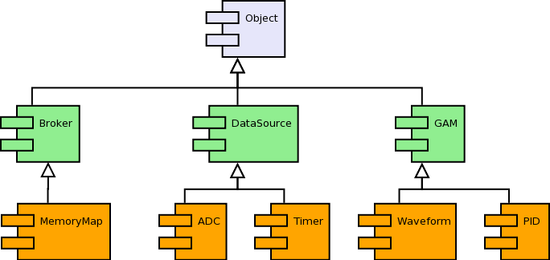
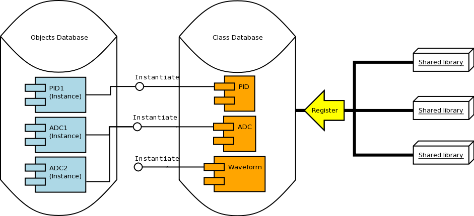

.. date: 27/03/2018
   author: Andre' Neto
   copyright: Copyright 2017 F4E | European Joint Undertaking for ITER and
   the Development of Fusion Energy ('Fusion for Energy').
   Licensed under the EUPL, Version 1.1 or - as soon they will be approved
   by the European Commission - subsequent versions of the EUPL (the "Licence")
   You may not use this work except in compliance with the Licence.
   You may obtain a copy of the Licence at: http://ec.europa.eu/idabc/eupl
   warning: Unless required by applicable law or agreed to in writing, 
   software distributed under the Licence is distributed on an "AS IS"
   basis, WITHOUT WARRANTIES OR CONDITIONS OF ANY KIND, either express
   or implied. See the Licence permissions and limitations under the Licence.

Objects
=======

The MARTe2 :vcisdoxygencl:`Object` is the root class of the framework and offers the following features:

- Automatic life cycle management using a smart pointer mechanism (see :doc:`references`);
- Data driven construction (in runtime) using the class name;
- Standard initialisation and configuration interface (more information :doc:`here </core/configuration/configuration>`);
- Standard messaging interface (more information :doc:`here </core/messages/messages>`);
- Allocation on a user selectable heap.

ClassRegistryDatabase
---------------------
   
In order to automatically register a  MARTe Object into the :vcisdoxygencl:`ClassRegistryDatabase`, the following macros must be used:  

- ``CLASS_REGISTER_DECLARATION()`` in the class declaration and;
- ``CLASS_REGISTER(NAME_OF_THE_CLASS)`` in the class definition, where NAME_OF_THE_CLASS is the name of the class where the ``CLASS_REGISTER_DECLARATION()`` has been declared;
   
.. code-block:: c++   

   class ControllerEx1: public MARTe::Object {
   public:
      /**
       * Compulsory for the class to be automatically registered.
       */
      CLASS_REGISTER_DECLARATION()
 
	  ControllerEx1() {	       
      }
      //Any other class methods
      ...    
   };

   //Usually declared in the .cpp unit file.
   CLASS_REGISTER(ControllerEx1, "")   
   
When a MARTe application starts (or when one of the shared libraries is explicitly opened, see the configuration Class= parameter :doc:`here </core/configuration/configuration>` ), these macros will force the relevant class to register in the :vcisdoxygencl:`ClassRegistryDatabase`.   

.. note:: The underlying mechanism is based on the fact that these macros create a :vcisdoxygencl:`ClassRegistryItem` global static variable (per class type) which will then automatically add (i.e. register) itself to the class database (see Add in :vcisdoxygencl:`ClassRegistryDatabase`).  
   

Once the class is registered the database can be queried and new object instances created.   
   
Examples
--------
   
The following examples show how to query the contents of a ClassRegistryDatabase...  

.. literalinclude:: /_static/examples/Core/ObjectsExample1.cpp
   :language: c++
   :emphasize-lines: 53,68,77,80,90
   :caption: ClassRegistryDatabase example (ObjectsExample1)
   :linenos:
   
... and how to instantiate a new object. Note that the Build method requires as an input an :vcisdoxygencl:`HeapI` implementation (this is particularly useful for embedded systems).    
   
.. literalinclude:: /_static/examples/Core/ObjectsExample2.cpp
   :language: c++
   :emphasize-lines: 79,82,85,87
   :caption: Object instantation example (ObjectsExample2)
   :linenos:
   
Instructions on how to compile and execute the examples can be found :doc:`here </examples>`.   

