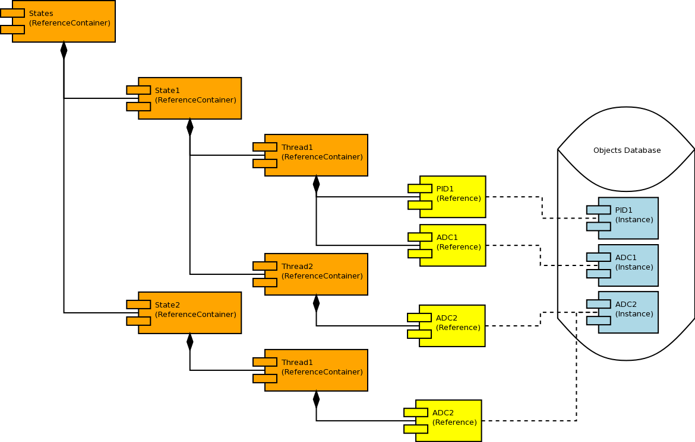

.. date: 28/03/2018
   author: Andre' Neto
   copyright: Copyright 2017 F4E | European Joint Undertaking for ITER and
   the Development of Fusion Energy ('Fusion for Energy').
   Licensed under the EUPL, Version 1.1 or - as soon they will be approved
   by the European Commission - subsequent versions of the EUPL (the "Licence")
   You may not use this work except in compliance with the Licence.
   You may obtain a copy of the Licence at: http://ec.europa.eu/idabc/eupl
   warning: Unless required by applicable law or agreed to in writing, 
   software distributed under the Licence is distributed on an "AS IS"
   basis, WITHOUT WARRANTIES OR CONDITIONS OF ANY KIND, either express
   or implied. See the Licence permissions and limitations under the Licence.

ReferenceContainers
===================

The :vcisdoxygencl:`ReferenceContainer` is one of the core classes of the framework and allows to create trees of references of any complexity.

Given that the :vcisdoxygencl:`ReferenceContainer` inherits from :vcisdoxygencl:`Object`, all the strategies described in the :doc:`references` section also apply.

.. code-block:: c++   

   //This is a valid way of creating a new ReferenceContainer
   ReferenceT<ReferenceContainer> ref("ReferenceContainer", GlobalObjectsDatabase::Instance()->GetStandardHeap());

.. note::

   The access to the container is protected by an internal :vcisdoxygencl:`FastPollingMutexSem` whose timeout can be specified.

The :vcisdoxygencl:`ReferenceContainer` Purge method must be called when the object is no longer needed (typically when the application terminates). The Purge function will destroy each element of the container a break any reference loops (the father contains a reference to the children and the children contains a reference to the father).
This method must also be used to implement any house-cleaning that is required before the elements are removed from the container (e.g. stopping threads that use these Objects).

.. warning::
   
   Avoid designs where classes have ReferenceContainer members. If you have to have such variables in your class, make sure that the Purge method is specialised to manually break any link  (see :vcisdoxygencl:`ReferenceContainer`), as otherwise unattended circular references may prevent the underlying Objects from being destroyed. See also the example below.

   .. image:: ReferenceContainer-2.png
   
The preferred strategy is to have the class directly inheriting from ReferenceContainer and to add any references to it. Note also that the ReferenceContainer may hold, contemporarily, references to any number of class types. 
   

Examples
--------
   
The following example shows how to add/get references to/from a container.

.. literalinclude:: /_static/examples/Core/ReferencesExample5.cpp
   :language: c++
   :emphasize-lines: 116, 141, 186, 193
   :caption: ReferenceContainer example (ReferenceExample5)
   :linenos:
        
This example highlights the circular reference problem. By specialising the Purge method, 

.. literalinclude:: /_static/examples/Core/ReferencesExample6.cpp
   :language: c++
   :emphasize-lines: 137-145,183-185 
   :caption: Circular reference (ReferenceExample6)
   :linenos: