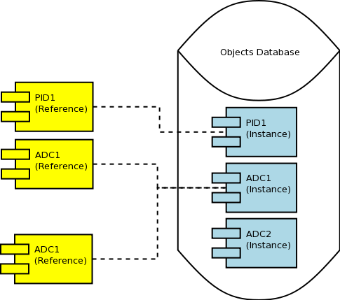

.. date: 28/03/2018
   author: Andre' Neto
   copyright: Copyright 2017 F4E | European Joint Undertaking for ITER and
   the Development of Fusion Energy ('Fusion for Energy').
   Licensed under the EUPL, Version 1.1 or - as soon they will be approved
   by the European Commission - subsequent versions of the EUPL (the "Licence")
   You may not use this work except in compliance with the Licence.
   You may obtain a copy of the Licence at: http://ec.europa.eu/idabc/eupl
   warning: Unless required by applicable law or agreed to in writing, 
   software distributed under the Licence is distributed on an "AS IS"
   basis, WITHOUT WARRANTIES OR CONDITIONS OF ANY KIND, either express
   or implied. See the Licence permissions and limitations under the Licence.

References
==========

:doc:`objects` are managed using :vcisdoxygencl:`Reference` components. 
 
References offer a smart pointer mechanism which guarantees that any MARTe Object can be safely shared (thread and interrupt safe) among different execution units. A different name can also be assigned to each object instance.  

.. important::
   
   The new and delete operators shall not be used to manage the life cycle of any of the framework objects. The framework offers an object creation mechanism that returns a reference.

Each time a new :vcisdoxygencl:`Reference` points at a given object, the :vcisdoxygencl:`Object` number of references is incremented. Conversely, when a new reference no longer points at an Object, e.g. because it lost scope, the number of reference is decremented. When the number of references pointing at any given object is equal to zero, the object is destroyed. 

The :vcisdoxygencl:`Reference` constructor allows to create a new object using the class name. 

.. code-block:: c++
   
   Reference ref1("AClassName", GlobalObjectsDatabase::Instance()->GetStandardHeap());

Using the templated version, :vcisdoxygencl:`ReferenceT`, the class type (or any of its polymorphic interfaces) is also constrained to be compatible with the class name.
This is the basic mechanism that allows to verify that classes are compatible with a given implementation (e.g. to verify what references are pointing to objects whose class inherit from :vcisdoxygencl:`GAM`). 

.. code-block:: c++
   
   Reference ref1("AClassName", GlobalObjectsDatabase::Instance()->GetStandardHeap());
   Reference<ADerivedClass> ref2 = ref1;
   
.. attention::

   Always check that a :vcisdoxygencl:`Reference` IsValid before using it! There are many reasons why a Reference may not be valid:
   - It was not initialised;
   - The reference class type is not compatible with the class name;  
   - When assigning a reference to an existent reference (ref1 = ref2), the classes are not compatible (e.g. because they do not share the same interface);
      
   
Examples
--------   
   
This example shows how to instantiate an Object by class name and how to assign a name to the instance.  

.. literalinclude:: /_static/examples/Core/ReferencesExample1.cpp
   :language: c++
   :emphasize-lines: 78-79,84-85,90,96,99
   :caption: Create by name example (ReferencesExample1)
   :linenos:
   
This example highlights how the number of references change during the life cycle of a program.  

.. literalinclude:: /_static/examples/Core/ReferencesExample2.cpp
   :language: c++
   :emphasize-lines: 83-84,108
   :caption: Reference counting (ReferencesExample2)
   :linenos:
   
This example shows how the :vcisdoxygencl:`ReferenceT` can be used to verify compliance of the class name against the expected class type (or derived interface). Note that the class name "PIDEx1"' is compatible with ControllerEx1. 
   
.. literalinclude:: /_static/examples/Core/ReferencesExample3.cpp
   :language: c++
   :emphasize-lines: 154, 176-178
   :caption: ReferenceT (ReferencesExample3)
   :linenos:

Instructions on how to compile and execute the examples can be found :doc:`here </core/examples>`.     