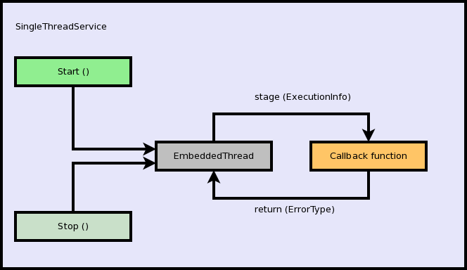
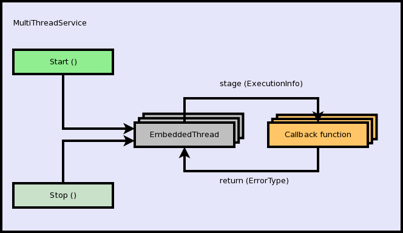
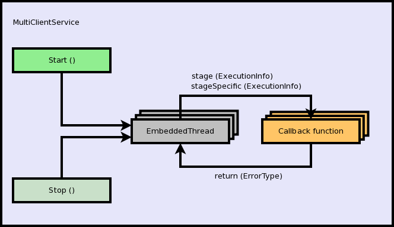

.. date: 27/03/2018
   author: Andre' Neto
   copyright: Copyright 2017 F4E | European Joint Undertaking for ITER and
   the Development of Fusion Energy ('Fusion for Energy').
   Licensed under the EUPL, Version 1.1 or - as soon they will be approved
   by the European Commission - subsequent versions of the EUPL (the "Licence")
   You may not use this work except in compliance with the Licence.
   You may obtain a copy of the Licence at: http://ec.europa.eu/idabc/eupl
   warning: Unless required by applicable law or agreed to in writing, 
   software distributed under the Licence is distributed on an "AS IS"
   basis, WITHOUT WARRANTIES OR CONDITIONS OF ANY KIND, either express
   or implied. See the Licence permissions and limitations under the Licence.

Services
========

In order to promote uniformity in the management of threads, and in particular of the thread initialisation and destruction processes, the framework offers a thread service abstraction (see :vcisdoxygencl:`EmbeddedServiceI`).

The following use-cases are covered: single-thread, multi-thread (each concurring for the same resource) and client oriented connection (e.g. web server).

The callback function (called by the service) shall have the following prototype: ``(MARTe::ErrorManagement::ErrorType (*)(MARTe::EmbeddedServiceI::ExecutionInfo &))``. The name of the callback function is registered by implementing the :vcisdoxygencl:`EmbeddedServiceMethodBinderT` interface.

All service implementations will continuously call the callback function with a given state (represented by the input :vcisdoxygencl:`ExecutionInfo`). The service will act accordingly to the returned value (see below).

.. note::

   The callback function shall avoid blocking the execution and return as soon as possible.

Any of the EmbeddedServices offers a ``Start`` and a ``Stop`` method. The latter guarantees that the thread is killed if it not gracefully terminated by the application with-in a given timeout period. 

All the thread parameters (affinity, stack, number of threads, ...) can be changed using the specific service API or using the standard ``Initialise`` method.

SingleThreadService
-------------------

The :vcisdoxygencl:`SingleThreadService` commands an :vcisdoxygencl:`EmbeddedThread` which in turn continuously call the registered callback function with one of the stages set below.

Depending on the callback return value, the :vcisdoxygencl:`ExecutionInfo` stage of each callback call is set as follows:  

+----------------------+-----------------------------------------------------------------------------------------------------------------------------------+
|Stage                 | Condition(s)                                                                                                                      |
+----------------------+-----------------------------------------------------------------------------------------------------------------------------------+
|StartupStage          | After ``SingleThreadService::Start()``.                                                                                           |
|                      +-----------------------------------------------------------------------------------------------------------------------------------+
|                      | If the callback returns an ErrorType which is not ``NoError`` and ``SingleThreadService::Stop()`` was not called.                 |
+----------------------+-----------------------------------------------------------------------------------------------------------------------------------+
|MainStage             | Until ``SingleThreadService::Stop()`` is called or if the callback returns an ErrorType which is not ``NoError``.                 |
+----------------------+-----------------------------------------------------------------------------------------------------------------------------------+
|TerminationStage      | If the callback returns an ErrorType which is ``ErrorManagement::Completed``.                                                     |
+----------------------+-----------------------------------------------------------------------------------------------------------------------------------+
|BadTerminationStage   | If the callback returns an ErrorType which is not ``ErrorManagement::Completed`` or if ``SingleThreadService::Stop()`` was called.|
+----------------------+-----------------------------------------------------------------------------------------------------------------------------------+
|AsyncTerminationStage | If the thread was killed after trying to gracefully terminate with a ``SingleThreadService::Stop()``.                             |
+----------------------+-----------------------------------------------------------------------------------------------------------------------------------+

The first time the ``SingleThreadService::Stop()`` is called, the EmbeddedThread will wait for the callback function to return and will call it one last time with the :vcisdoxygencl:`ExecutionInfo` stage set to ``BadTerminationStage``.

If, in the meanwhile, the ``SingleThreadService::Stop()`` is called a second time, the thread will be killed (see ``Kill`` in the :vcisdoxygenns:`Threads` API) and the callback will be (asynchronously) called with the :vcisdoxygencl:`ExecutionInfo` stage set to ``AsyncTerminationStage``.  

.. warning::

   The service can only be killed if a **finite** timeout was configured, otherwise it will wait forever to be gracefully stopped.

MultiThreadService
------------------

The :vcisdoxygencl:`MultiThreadService` offers an equivalent function to the :vcisdoxygencl:`EmbeddedServiceI` with one or more threads. The threads will concurrently call the callback function.

MultiClientService
------------------

The :vcisdoxygencl:`MultiClientService` is a connection oriented implementation of the service described above. In particular the ``GetStageSpecific`` of the  :vcisdoxygencl:`ExecutionInfo` is used to trigger connection oriented events:

+----------------------------+---------------------------------+
|StageSpecific               | Condition(s)                    |
+----------------------------+---------------------------------+
|WaitRequestStageSpecific    | Wait for a connection request.  |
+----------------------------+---------------------------------+
|ServiceRequestStageSpecific | Serve a specific request.       |
+----------------------------+---------------------------------+

The number of threads is allowed to be increased/decreased by the service between the values defined by ``GetMinimumNumberOfPoolThreads ()`` and ``GetMaximumNumberOfPoolThreads ()``.

.. note::

   The callback should not block and should return ``ErrorManagement::Timeout`` while awaiting for a connection to be established.
   After a connection is established (ServiceRequestStageSpecific) the callback shall return ``ErrorManagement::Completed`` when the service has been completed. 
   
Examples
--------

SingleThreadService
~~~~~~~~~~~~~~~~~~~

The following is an example which highlights all the possible :vcisdoxygencl:`ExecutionInfo` callback stages.

.. literalinclude:: /_static/examples/Core/SingleThreadServiceExample1.cpp
   :language: bash	
   :caption: Example of a SingleThreadService
   :linenos:
   :emphasize-lines: 48,52,70,78,81,90,95,103,159,163,166

MultiThreadService
~~~~~~~~~~~~~~~~~~

This is an example similar to the above but with a MultiThreadService.

.. literalinclude:: /_static/examples/Core/MultiThreadServiceExample1.cpp
   :language: c++
   :caption: Example of a MultiThreadService
   :linenos:
   :emphasize-lines: 48,53,72,87,90,99,104,112,139,169,176,179

MultiClientService
~~~~~~~~~~~~~~~~~~

The custom component ``TCPSocketMessageProxyExample`` forwards TCP *messages* into MARTe messages.

.. literalinclude:: /_static/examples/Core/TCPSocketMessageProxyExample.cpp
   :language: c++
   :caption: Example of a MultiClientService
   :linenos:
   :emphasize-lines: 49,58-59,93,108,118-119,125,132,136,181

**Start the application with the -m parameter**.

In order to change state, start the application and, in another console, type ``echo -e "Destination=StateMachine\nFunction=GOTOSTATE2" | nc 127.0.0.1 24680``.
	
.. literalinclude:: /_static/examples/Configurations/RTApp-3.cfg
   :language: bash	
   :caption: Multiple states configuration (Run with NAME_OF_THE_MESSAGE=StateMachine:START and NAME_OF_THE_CONFIGURATION_FILE=RTApp-3.cfg)
   :linenos:
   :emphasize-lines: 1-3

Instructions on how to compile and execute the examples can be found :doc:`here </core/examples>`.