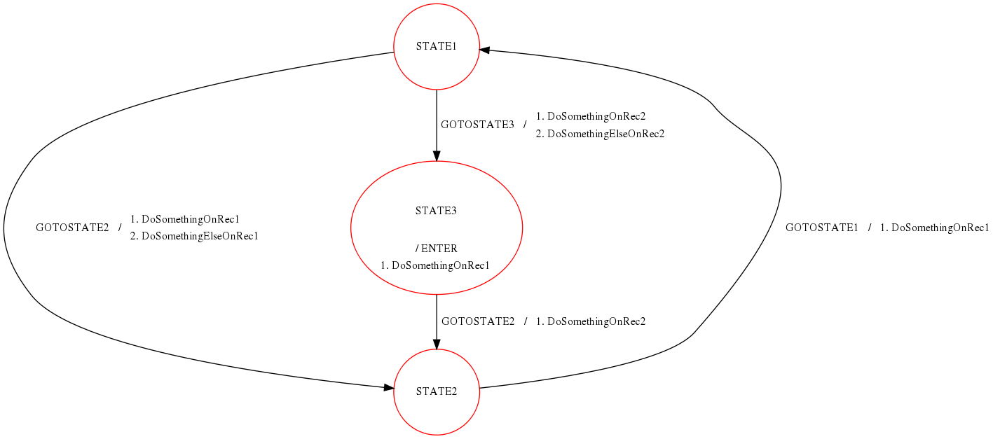

.. date: 25/04/2018
   author: Andre' Neto
   copyright: Copyright 2017 F4E | European Joint Undertaking for ITER and
   the Development of Fusion Energy ('Fusion for Energy').
   Licensed under the EUPL, Version 1.1 or - as soon they will be approved
   by the European Commission - subsequent versions of the EUPL (the "Licence")
   You may not use this work except in compliance with the Licence.
   You may obtain a copy of the Licence at: http://ec.europa.eu/idabc/eupl
   warning: Unless required by applicable law or agreed to in writing, 
   software distributed under the Licence is distributed on an "AS IS"
   basis, WITHOUT WARRANTIES OR CONDITIONS OF ANY KIND, either express
   or implied. See the Licence permissions and limitations under the Licence.

StateMachine
============

The MARTe :vcisdoxygencl:`StateMachine` components allows to associate the sending of :doc:`Messages </core/messages/messages>` to events.

Each state contains one, or more, :vcisdoxygencl:`StateMachineEvent` elements. The StateMachine can be in one (**and only one**) state at a given time.

The StateMachine is a key component which is used in many MARTe applications to synchronise the application state against the external environment. 

Upon receiving of a Message, the StateMachine will verify if the :vcisdoxygencl:`Message` function (see GetFunction) is equal to the name of any of the declared :vcisdoxygencl:`StateMachineEvent` elements for the current StateMachine state.
If it is, the StateMachine will change to the declared state and trigger any messages associated to this transition.

.. note::

   If a state change requests arrives while the state is being changed, this request will be queued and served once the previous state transition is completed.

Configuration
~~~~~~~~~~~~~

Each state is declared as a :doc:`ReferenceContainer </core/objects/referencecontainers>` of :vcisdoxygencl:`StateMachineEvent` elements.

.. code-block:: bash

   +StateMachine = {
      Class = StateMachine
      +STATE1 = {
         Class = ReferenceContainer
         +GOTOSTATE2 = {
            Class = StateMachineEvent
            ...
         }
         +ERROR = {
            Class = StateMachineEvent
            ...
         }
         ...
      }
      +STATE2 = {
         Class = ReferenceContainer
         +GOTOSTATE1 = {
            Class = StateMachineEvent
            ...
         }
         +ERROR = {
            Class = StateMachineEvent
            ...
         }
         ...
      }

Each StateMachineEvent contains the ``NextState`` (where to go), the ``NextStateError`` (where to go in case of any error while sending the messages) and one or more messages to be sent when the event is triggered.

.. code-block:: bash

   +StateMachine = {
      Class = StateMachine
      +STATE1 = {
         Class = ReferenceContainer
         +GOTOSTATE2 = {
            Class = StateMachineEvent
            NextState = "STATE2"
            NextStateError = "ERROR"
            Timeout = 0
            +DoSomething = {
                Class = Message
                Destination = Receiver1
                Mode = ExpectsReply
                Function = Function1
                +Parameters = {
                    Class = ConfigurationDatabase
                    param1 = 2
                    param2 = 3.14
                }
            }
            +DoSomethingElse = {
                Class = Message
                Destination = Receiver1
                Mode = ExpectsReply
                Function = Function0
            }
         }
         +GOTOSTATE3 = {
            Class = StateMachineEvent
            NextState = "STATE3"
            NextStateError = "ERROR"
            Timeout = 0
            +DoSomething = {
                Class = Message
                Destination = Receiver1
                Mode = ExpectsReply
                Function = Function1
                +Parameters = {
                    Class = ConfigurationDatabase
                    param1 = 4
                    param2 = 5.312
                }
            }
         }
         ...

.. note::
   
   The StateMachine is not compatible with the usage of the GAMBareScheduler for more than two states. The first state being the state started in and then the second being the next state. This is because the StartNextExecution function
   of the GAMBareScheduler is a non-returning infinite while loop and stalls the StateMachine at the state transition point while executing the second state.

The ``Timeout`` parameter sets the maximum amount of time allowed for the state transition (including waiting for all the requested replies to arrive). An infinite timeout is defined with a value of ``0``.

.. note::

   The message replies can be used to guarantee that the state transitions only complete when given events occur/complete.

If an *event* named ``ENTER`` of type ``ReferenceContainer`` exists, all of its contained messages will be triggered when entering the state.
 
.. code-block:: bash

   +StateMachine = {
      Class = StateMachine
      +STATE1 = {
         Class = ReferenceContainer
         +ENTER = {
             Class = ReferenceContainer
             +DoSomethingWhenEntering = {
                Class = Message
                Destination = Receiver1
                Mode = ExpectsReply
                Function = Function1
                +Parameters = {
                    Class = ConfigurationDatabase
                    param1 = 4
                    param2 = 5.312
                }
             }
             +DoSomethingElseWhenEntering = {
                Class = Message
                Destination = Receiver2
                Mode = ExpectsReply
                Function = Function1
                +Parameters = {
                    Class = ConfigurationDatabase
                    param1 = 8
                    param2 = -5.312
                }
             }
         }
         +GOTOSTATE2 = {
            Class = StateMachineEvent
            ...
            
Examples
--------

The following is an example which shows how a state machine can be used to trigger remote function calls:

.. literalinclude:: /_static/examples/Core/StateMachineExample1.cpp
   :language: c++
   :caption: Example of a StateMachine receiving and triggering messages.
   :linenos:
   :emphasize-lines: 136,138,140-143,145-153,207-219
   
Instructions on how to compile and execute the examples can be found :doc:`here </core/examples>`.
