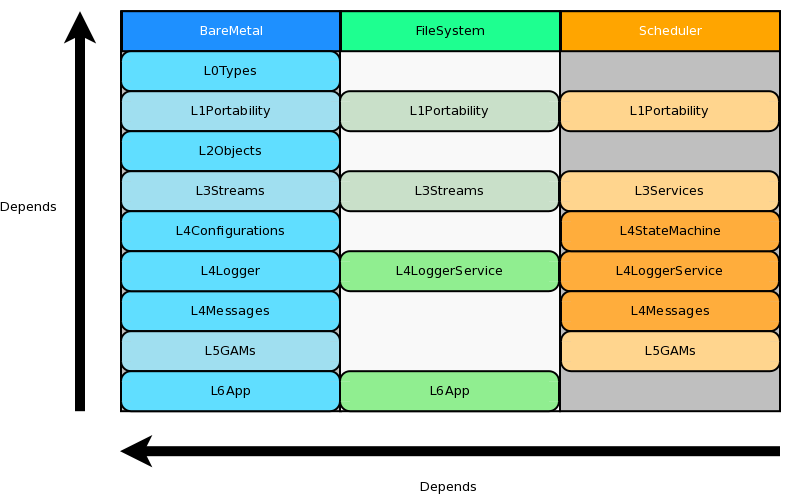
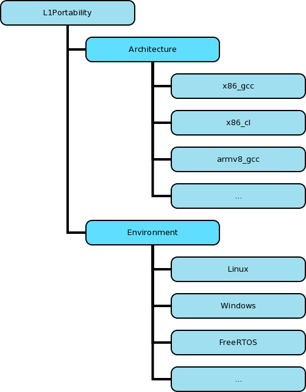

.. date: 18/04/2018
   author: Andre' Neto
   copyright: Copyright 2017 F4E | European Joint Undertaking for ITER and
   the Development of Fusion Energy ('Fusion for Energy').
   Licensed under the EUPL, Version 1.1 or - as soon they will be approved
   by the European Commission - subsequent versions of the EUPL (the "Licence")
   You may not use this work except in compliance with the Licence.
   You may obtain a copy of the Licence at: http://ec.europa.eu/idabc/eupl
   warning: Unless required by applicable law or agreed to in writing, 
   software distributed under the Licence is distributed on an "AS IS"
   basis, WITHOUT WARRANTIES OR CONDITIONS OF ANY KIND, either express
   or implied. See the Licence permissions and limitations under the Licence.

Code organisation
=================

In order to ease the portability to other architectures and operating systems the code is organised in three tiers and seven levels.

Each tier is an independent library.  The ``BareMetal`` library is designed to be independent from the file system and from the scheduler, thus allowing to deploy the framework in very embedded systems.

Each level encapsulates a given functional concept and only depends on the functionality provided by any levels above it.

Levels
------

BareMetal
~~~~~~~~~

================================================================ ============
Name                                                             Description
================================================================ ============
:doc:`L0Types </core/types/types>`                               Definition of the basic types that shall be used by any code using the library.
L1Portability                                                    Code that is either operating system or architecture dependent (atomic operations, memory management, sleep, ...) together with components that depend on definitions that are available on ``L0Types``.
:doc:`L2Objects </core/objects/objects>`                         Root classes of the framework.
:doc:`L3Streams </core/streams/streams>`                         Definition of the concept of Stream.
:doc:`L4Configuration </core/configuration/configuration>`       Infrastructure which allows to build fully data-driven applications.
:doc:`L4Logger </core/logging/logging>`                          Definition of the logging system.
:doc:`L4Messages </core/messages/messages>`                      Dynamic exchange of messages between MARTe components.
:doc:`L5GAMs </core/gams/rtapp>`                                 MARTe real-time application components.
:doc:`L4LoggerService </core/logging/logging>`                   Logging components that use the file system (e.g. UDP logger).
:doc:`L6App </core/app/app>`                                     Application kick-start (bare metal).
================================================================ ============

FileSystem 
~~~~~~~~~~

================================================================ ============
Name                                                             Description
================================================================ ============
L1Portability                                                    File system code that is either operating system or architecture dependent (files, sockets, ...).
:doc:`L3Streams </core/streams/streams>`                         Portable definition of streams (no operating system dependent code).
:doc:`L4LoggerService </core/logging/logging>`                   Logging components that use the file system (e.g. UDP logger).
:doc:`L6App </core/app/app>`                                     Application kick-start code that depends on the file-system (e.g. reading a configuration file).
================================================================ ============

Scheduler 
~~~~~~~~~

================================================================ ============
Name                                                             Description
================================================================ ============
L1Portability                                                    Scheduler code that is either operating system or architecture dependent (semaphores, threads, ...).
:doc:`L3Services </core/scheduling/services>`                    Components that provide a unique model for the management of threads and services.
:doc:`L4LoggerService </core/logging/logging>`                   Logging components that use the scheduler (logging queues on independent threads, ...).
:doc:`L4Messages </core/messages/messages>`                      Support to message queues.
:doc:`L4StateMachine </core/statemachine/statemachine>`          The MARTe state-machine.
:doc:`L5GAMs </core/gams/rtapp>`                                 MARTe real-time application components that require a scheduler.
================================================================ ============

Portability
-----------

The operating systems and architecture dependent code is encapsulated in the ``Architecture`` and ``Environment`` folders inside the ``L1Portability`` and  ``L6App`` folders. In the levels' root folders no operating system and architecture code shall exist.

Based on the :doc:`Makefile </core/makefile/makefile>` ``ARCHITECTURE`` and ``ENVIRONMENT`` identifiers, the correct header files will be included during the code compilation.

.. code-block:: c++
 
   #include INCLUDE_FILE_ARCHITECTURE(ARCHITECTURE,AtomicA.h)
   #include INCLUDE_FILE_ENVIRONMENT(ENVIRONMENT,BasicFileProperties.h) 

Each new operating system or architecture will have to create a new folder with the operating system or architecture identifier and implement all the relevant files.

Namespace
---------

A single namespace, named ``MARTe``, is used for all the core library (and for the MARTe2-components).