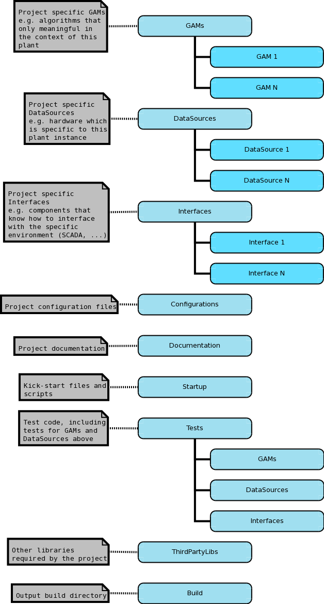

.. date: 27/03/2018
   author: Andre' Neto
   copyright: Copyright 2017 F4E | European Joint Undertaking for ITER and
   the Development of Fusion Energy ('Fusion for Energy').
   Licensed under the EUPL, Version 1.1 or - as soon they will be approved
   by the European Commission - subsequent versions of the EUPL (the "Licence")
   You may not use this work except in compliance with the Licence.
   You may obtain a copy of the Licence at: http://ec.europa.eu/idabc/eupl
   warning: Unless required by applicable law or agreed to in writing, 
   software distributed under the Licence is distributed on an "AS IS"
   basis, WITHOUT WARRANTIES OR CONDITIONS OF ANY KIND, either express
   or implied. See the Licence permissions and limitations under the Licence.

Deploying
=========

A typical MARTe2 project is made of: the core library; a set of reusable components from the :doc:`MARTe2-components library </components>` and a collection of project specific components (i.e. that are not distributed to the community in the MARTe2-components).

.. toctree::
   :maxdepth: 1
   :caption: Contents:

   buildsources
   rpm
   linux
   
