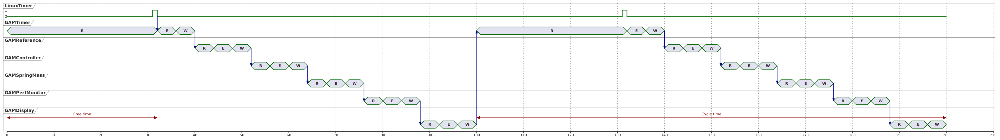

.. date: 24/03/2026
   author: Andre' Neto
   copyright: Copyright 2017 F4E | European Joint Undertaking for ITER and
   the Development of Fusion Energy ('Fusion for Energy').
   Licensed under the EUPL, Version 1.1 or - as soon they will be approved
   by the European Commission - subsequent versions of the EUPL (the "Licence")
   You may not use this work except in compliance with the Licence.
   You may obtain a copy of the Licence at: http://ec.europa.eu/idabc/eupl
   warning: Unless required by applicable law or agreed to in writing, 
   software distributed under the Licence is distributed on an "AS IS"
   basis, WITHOUT WARRANTIES OR CONDITIONS OF ANY KIND, either express
   or implied. See the Licence permissions and limitations under the Licence.

Performance monitoring
======================

In this section, we will build upon the previous example and add features that allow to monitor the performance of the MARTe2 application, namely the :ref:`timing <MARTeTimingDataSource>` of the GAMs and of the thread cycle time.

Namely, we will want to monitor:

- The cycle time of the thread executing the GAMs. This is the time between two consecutive executions of the thread. It is expected to be constant and equal to the inverse of the `Frequency` parameter of the ``GAMTimer``.
- The execution time of the GAMs. This is the time taken by the GAMs to execute their logic.
- The time it took to copy from the DataSource to the GAMs. This includes any overhead of the DataSource (e.g. to access the hardware) and the time taken to copy the data from the DataSource to the GAMs. 
- The time it took to copy from the GAMs to the DataSources. This includes any overhead of the DataSource (e.g. to access the hardware) and the time taken to copy the data from the GAMs to the DataSources. 

All the times are absolute with respect to the start of the real-time cycle and are measured in microseconds. 

   Timing diagram for the mass-spring-damper system. 

.. note::
   The GAM that synchronises with the DataSource pacing the thread waits during its read phase for the trigger to arrive. Consequently, this provides an indirect measurement of the thread’s available free time (the higher, the better). 

.. note::
    The cycle time is measured between the end of two consecutive cycles, rather than between the thread’s synchronisation points (i.e. when the LinuxTimer is triggered). While this is typically not an issue, if the GAM load varies over time it may result in a cycle time that appears non-constant, even when the synchronisation trigger is very stable.

.. note::
    Since the measurements are taken during the cycle, the execution order of the GAM that reads from the Timing DataSource determines whether the reported times for other GAMs correspond to the current or the previous cycle. If the Timing GAM executes before the others, the reported times will refer to the previous cycle, but will remain consistent across all GAMs.

   .. literalinclude:: /_static/tutorial/Configurations/MassSpring/RTApp-MassSpring-3.cfg
      :language: c++
      :lines: 383-387 
      :caption: Updated configuration with the two missing GAMs.
      :linenos:
      :emphasize-lines: 4

Running the application
-----------------------

Start the application with:

.. code-block:: bash

    ./MARTeApp.sh -f ../Configurations/MassSpring/RTApp-MassSpring-3.cfg -l RealTimeLoader -s State1

Once the application is running, inspect the ``screen`` output and verify that the log shows the cycle time and the execution times of the GAMs. The log should show entries similar to the following:

.. code-block:: console

    $ [Information - LoggerBroker.cpp:152]: Thread1CycleTime [0:0]:9992
    $ [Information - LoggerBroker.cpp:152]: GAMTimer_ReadTime [0:0]:9878
    $ [Information - LoggerBroker.cpp:152]: GAMTimer_ExecTime [0:0]:9878
    $ [Information - LoggerBroker.cpp:152]: GAMTimer_WriteTime [0:0]:9878
    $ [Information - LoggerBroker.cpp:152]: GAMReference_ExecTime [0:0]:9879
    $ [Information - LoggerBroker.cpp:152]: GAMReference_WriteTime [0:0]:9879
    $ [Information - LoggerBroker.cpp:152]: GAMController_ReadTime [0:0]:9879
    $ [Information - LoggerBroker.cpp:152]: GAMController_ExecTime [0:0]:9879
    $ [Information - LoggerBroker.cpp:152]: GAMController_WriteTime [0:0]:9879
    $ [Information - LoggerBroker.cpp:152]: GAMDisplay_ReadTime [0:0]:9896
    $ [Information - LoggerBroker.cpp:152]: GAMDisplay_ExecTime [0:0]:9897
    $ [Information - LoggerBroker.cpp:152]: GAMDisplay_WriteTime [0:0]:9991
    ...

Exercices
---------

Ex. 1: Add the missing times 
----------------------------

1. Edit the file ``../Configurations/MassSpring/RTApp-MassSpring-4.cfg`` and add the `Read`, `Exec`, and `Write` times for the two missing GAMs.
2. Verify that the two missing times are now present in the logger output.

.. code-block:: bash

    ./MARTeApp.sh -f ../Configurations/MassSpring/RTApp-MassSpring-4.cfg -l RealTimeLoader -s State1

.. dropdown:: Solution
   :icon: key

   The solution is to add the missing signals in the `GAMPerMonitor` and `GAMDisplay`.

   .. literalinclude:: /_static/tutorial/Configurations/MassSpring/RTApp-MassSpring-4-solution.cfg
      :language: c++
      :lines: 104-106, 144-167,181,218-241,256-258,315-338,352,409-432
      :caption: Updated configuration with the two missing GAMs.
      :linenos:

