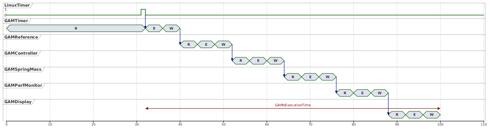

.. date: 25/03/2026
   author: Andre' Neto
   copyright: Copyright 2017 F4E | European Joint Undertaking for ITER and
   the Development of Fusion Energy ('Fusion for Energy').
   Licensed under the EUPL, Version 1.1 or - as soon as they will be approved
   by the European Commission - subsequent versions of the EUPL (the "Licence")
   You may not use this work except in compliance with the Licence.
   You may obtain a copy of the Licence at: http://ec.europa.eu/idabc/eupl
   warning: Unless required by applicable law or agreed to in writing, 
   software distributed under the Licence is distributed on an "AS IS"
   basis, WITHOUT WARRANTIES OR CONDITIONS OF ANY KIND, either express
   or implied. See the Licence permissions and limitations under the Licence.

Math expressions
================

This section builds upon the previous example and adds features that allow computing mathematical expressions on the MARTe2 signals.

The expressions are implemented using the :vcisdoxygenmccl:`MathExpressionGAM`, which allows computing mathematical expressions on the input signals and providing the result in the output signals. The expressions are defined in a configuration file and can use any of the input signals as variables. It also supports ``Constants`` in numeric and literal form.

The backend of the ``MathExpressionGAM`` is the :ref:`MathExpressionParser <MathExpressionParser>`.

In this example, the ``MathExpressionGAM`` is used to compute the time taken by all the GAMs to execute their logic by subtracting the write time of the last GAM from the read time of the first GAM, that is: ``GAMsExecutionTime = GAMDisplay_WriteTime - GAMTimer_ReadTime``.

   Time required to execute all GAMs. 

.. literalinclude:: /_static/tutorial/Configurations/MassSpring/RTApp-MassSpring-8.cfg
    :language: c++
    :lines: 256-275
    :caption: MathExpressionGAM configuration.
    :linenos:
    :emphasize-lines: 3

.. warning::

  The ``MathExpressionGAM`` is very sensitive to the types used. Carefully review the documentation of the :vcisdoxygenmccl:`MathExpressionGAM` and ensure that values are cast as required.

Running the application
-----------------------

Start the application with:

.. code-block:: bash

    ./MARTeApp.sh -f ../Configurations/MassSpring/RTApp-MassSpring-8.cfg -l RealTimeLoader -s State1

Once the application is running, inspect the ``screen`` output and verify that the log shows the ``GAMsExecutionTime`` value. The log should show entries similar to the following:

.. code-block:: console

    $ [Information - LoggerBroker.cpp:152]: Thread1FreeTimeHistogram [0:10]:{ 0 0 0 0 0 0 0 0 0 50 23 }
    $ [Information - LoggerBroker.cpp:152]: GAMsExecutionTime [0:0]:206
    $ [Information - LoggerBroker.cpp:152]: ForceAverage [0:0]:20.342940

Exercises
---------

Ex. 1: Implement the mass spring model with the MathExpressionGAM
------------------------------------------------------------------

The ``MathExpressionGAM`` can be used to implement the mass-spring-damper model by defining the equations of motion as mathematical expressions. This allows implementing the model without the need to write a custom GAM, while still benefiting from the features of the ``MathExpressionGAM``.

Consider the continuous-time state-space model of the spring–mass system:

.. math::

   \dot{x}(t) = A x(t) + B u(t)

where the state vector is defined as:

.. math::

   x(t) =
   \begin{bmatrix}
   x_1(t) \\
   x_2(t)
   \end{bmatrix}
   =
   \begin{bmatrix}
   \text{position} \\
   \text{velocity}
   \end{bmatrix}

and the system dynamics are:

.. math::

   \dot{x}_1 = x_2

.. math::

   \dot{x}_2 = -\frac{k}{m}x_1 - \frac{c}{m}x_2 + \frac{1}{m}u

Using forward Euler discretisation with sampling time :math:`T_s`:

.. math::

   x[k+1] = x[k] + T_s \dot{x}[k]

the discrete-time equations become:

.. math::

   x_1[k+1] = x_1[k] + T_s x_2[k]

.. math::

   x_2[k+1] = x_2[k] + T_s\left(-\frac{k}{m}x_1[k] - \frac{c}{m}x_2[k] + \frac{1}{m}u[k]\right)

1. Edit the file ``../Configurations/MassSpring/RTApp-MassSpring-8.cfg`` and modify the existing ``MathExpressionGAM``, named ``GAMMathModel``, to compute the equations above.
2. Connect the output of the ``GAMMathModel`` to the ``GAMDisplay`` to log the position and velocity of the mass. In order to avoid conflicting name definitions, call the signals ``PositionM`` and ``VelocityM``.

.. dropdown:: Solution
   :icon: key

   The solution is to modify the ``GAMMathModel`` and add the equations to the ``Expression`` field.

   .. literalinclude:: /_static/tutorial/Configurations/MassSpring/RTApp-MassSpring-9-solution.cfg
      :language: c++
      :lines: 276-313
      :caption: Updated configuration with the GAMMathModel.
      :linenos:

Ex. 2: Compare the output from both models 
------------------------------------------

When running the application, the output given by the ``GAMMathModel`` and the one computed by the ``GAMSpringMass`` are similar but not exactly the same.

1. Edit the file ``../Configurations/MassSpring/RTApp-MassSpring-10.cfg`` and add a ``MathExpressionGAM`` to compute the difference between the ``Position`` value computed by the two models.
2. Why is the ``PositionM`` value never converging to the target value? What could be done to modify this behaviour?

.. dropdown:: Solution
   :icon: key

   The solution is to add the signal to the ``HistogramGAM`` and connect it to the ``GAMDisplay``.

   .. literalinclude:: /_static/tutorial/Configurations/MassSpring/RTApp-MassSpring-7-solution.cfg
      :language: c++
      :lines: 331-360
      :caption: Updated configuration with the Force statistics.
      :linenos: 
      :emphasize-lines: 11, 24

  The ``PositionM`` value is never converging to the target value because the ``GAMController`` is using the ``Position`` value as feedback. Try modifying it to use the ``PositionM`` value instead.