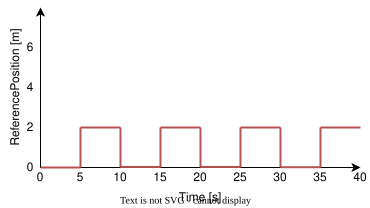

.. date: 27/03/2026
   author: Andre' Neto
   copyright: Copyright 2017 F4E | European Joint Undertaking for ITER and
   the Development of Fusion Energy ('Fusion for Energy').
   Licensed under the EUPL, Version 1.1 or - as soon as they will be approved
   by the European Commission - subsequent versions of the EUPL (the "Licence")
   You may not use this work except in compliance with the Licence.
   You may obtain a copy of the Licence at: http://ec.europa.eu/idabc/eupl
   warning: Unless required by applicable law or agreed to in writing, 
   software distributed under the Licence is distributed on an "AS IS"
   basis, WITHOUT WARRANTIES OR CONDITIONS OF ANY KIND, either express
   or implied. See the Licence permissions and limitations under the Licence.

Waveforms
=========

In this section, we will modify the application to generate the ``ReferencePosition`` signal as a waveform instead of a constant.

The waveforms are implemented using the ``WaveformGAM``. 

The GAM allows generating three types of waveforms:

- :vcisdoxygenmccl:`WaveformSin`, for sinusoidal waveforms.
- :vcisdoxygenmccl:`WaveformChirp`, for waveforms where the frequency varies over time.
- :vcisdoxygenmccl:`WaveformPointsDef`, for waveforms defined by a set of points. The points are defined as a list of time-value pairs, where the time is relative to the start of the waveform and the value is the value of the signal at that time. The values between the defined points are computed by linear interpolation. The waveform is periodically repeated when the time is greater than the duration of the waveform.

In this example, the ``WaveformGAM`` is used to slowly modify the ``ReferencePosition`` as shown in the following figure.

.. figure:: images/mass_spring_refpos_ramp.svg
   :align: center
   :alt: Mass-spring-damper reference position ramp.
   :width: 400px

   Reference position ramp.

.. literalinclude:: /_static/tutorial/Configurations/MassSpring/RTApp-MassSpring-11.cfg
    :language: c++
    :lines: 39-56
    :caption: WaveformGAM::WaveformPointsDef configuration.
    :linenos:
    :emphasize-lines: 2-4

.. note::

   The ``WaveformGAM`` is an example of how to instantiate classes with a name different from the library name, as described :ref:`here <MARTeDataDrivenApplications>`.

Running the application
-----------------------

Start the application with:

.. code-block:: bash

    ./MARTeApp.sh -f ../Configurations/MassSpring/RTApp-MassSpring-11.cfg -l RealTimeLoader -s State1

Once the application is running, inspect the ``screen`` output and verify that the log shows the ``ReferencePosition`` value varying as a function of time. The log should show entries similar to the following:

.. code-block:: console

   $ [Information - LoggerBroker.cpp:152]: Time [0:0]:1040000
   $ [Information - LoggerBroker.cpp:152]: ReferencePosition [0:0]:0.416000
   $ [Information - LoggerBroker.cpp:152]: Position [0:0]:0.354657

Exercises
---------

Ex. 1: Modify the waveform 
--------------------------

1. Edit the file ``../Configurations/MassSpring/RTApp-MassSpring-12.cfg`` and modify the existing ``GAMReferenceWaveform`` to implement the following figure.

   Reference position square wave.

.. dropdown:: Solution
   :icon: key

   The solution is to modify the ``GAMReferenceWaveform`` and add points near the transition regions so that the change is as sharp as possible.

   .. literalinclude:: /_static/tutorial/Configurations/MassSpring/RTApp-MassSpring-12-solution.cfg
      :language: c++
      :lines: 39-56
      :caption: Updated configuration with sharp transitions.
      :linenos:
      :emphasize-lines: 3-4

Ex. 2: Add a disturbance to the system
---------------------------------------

1. Edit the file ``../Configurations/MassSpring/RTApp-MassSpring-13.cfg`` and add a disturbance to the ``Position`` signal before it enters the controller. The disturbance should be a sinusoidal signal with an amplitude of ``0.01`` and a frequency of 10 Hz.

.. dropdown:: Solution
   :icon: key

   The solution is to add a ``WaveformSin`` to generate the disturbed ``PositionDisturbance`` signal.

   .. literalinclude:: /_static/tutorial/Configurations/MassSpring/RTApp-MassSpring-13-solution.cfg
      :language: c++
      :lines: 39-57
      :caption: WaveformSin to generate the disturbed signal.
      :linenos: 
      :emphasize-lines: 5-6

   The ``PositionDisturbance`` signal should then be added to the ``Position`` before it enters the controller.

   .. literalinclude:: /_static/tutorial/Configurations/MassSpring/RTApp-MassSpring-13-solution.cfg
      :language: c++
      :lines: 58-77
      :caption: Addition of the disturbed signal to the ``Position``.
      :linenos: 
      :emphasize-lines: 3

   Modify the ``GAMController`` to use the disturbed signal instead of the original ``Position`` signal.

   .. literalinclude:: /_static/tutorial/Configurations/MassSpring/RTApp-MassSpring-13-solution.cfg
      :language: c++
      :lines: 96-127
      :caption: Modified controller to use the disturbed signal.
      :linenos: 
      :emphasize-lines: 17

   Make sure that the GAMs are added to the execution list and that the new signals are added to the ``GAMDisplay`` for monitoring.

   Note that the disturbance causes the system to oscillate around the reference position, and the controller tries to compensate for the disturbance to keep the position close to the reference.