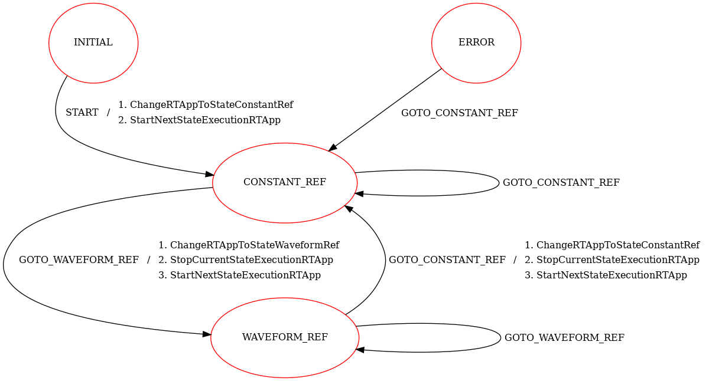
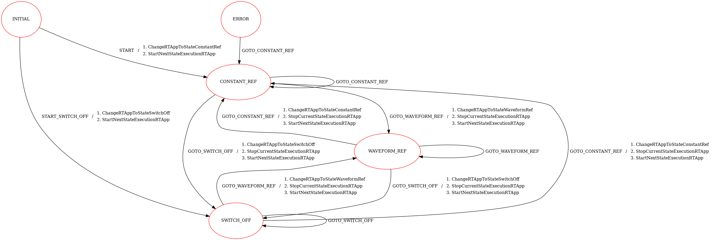

.. date: 13/04/2026
   author: Andre' Neto
   copyright: Copyright 2017 F4E | European Joint Undertaking for ITER and
   the Development of Fusion Energy ('Fusion for Energy').
   Licensed under the EUPL, Version 1.1 or - as soon they will be approved
   by the European Commission - subsequent versions of the EUPL (the "Licence")
   You may not use this work except in compliance with the Licence.
   You may obtain a copy of the Licence at: http://ec.europa.eu/idabc/eupl
   warning: Unless required by applicable law or agreed to in writing, 
   software distributed under the Licence is distributed on an "AS IS"
   basis, WITHOUT WARRANTIES OR CONDITIONS OF ANY KIND, either express
   or implied. See the Licence permissions and limitations under the Licence.

StateMachine
============

The MARTe2 :vcisdoxygencl:`StateMachine` (see also :ref:`MARTeStateMachine`) allows to change the state of the application asynchronously, based on external triggers. This can be used to implement different behaviours of the application based on the state of the system.

The StateMachine is based around the concept of :ref:`MARTeMessages`, which are used to trigger the state changes. Each state can have one or more :vcisdoxygencl:`StateMachineEvent` elements, which define the state transitions and the associated messages. The StateMachine transition may then trigger the sending of other messages, which can be used to trigger actions in the RealTimeApplication or directly in components (e.g. GAMs or DataSources). For example, the :vcisdoxygenmccl:`ConstantGAM` can change the constant value upon receiving a message.

In this first example the StateMachine allows to change the state of the application between a state where the reference position is set to 2.0 and a state where the reference position is set using a waveform. The configuration of the StateMachine is shown in the following listing.

.. literalinclude:: /_static/tutorial/Configurations/MassSpring/RTApp-MassSpring-50.cfg
    :language: c++
    :lines: 1-68
    :caption: StateMachine configuration. The application can start in either state depending on the command line argument.
    :linenos:
    :emphasize-lines: 5, 17, 27, 39

Depending on the selected initial the Message parameter will match either the RealTimeApplication state, as shown in the following listing.

.. literalinclude:: /_static/tutorial/Configurations/MassSpring/RTApp-MassSpring-50.cfg
    :language: c++
    :lines: 894-898,913-915
    :caption: RealTimeApplication state definition.
    :linenos:
    :emphasize-lines: 3,6

A second application makes use of the :vcisdoxygenmccl:`MessageGAM` to change the reference position based on the application state. The application has two main states ``WAVEFORM_REF`` and ``CONSTANT_REF``. The ``StateMachine`` will change the state and trigger the associated messages as shown in the figure below:

   StateMachine diagram showing the state transitions and the associated Messages: In ``WAVEFORM_REF`` the message ``GOTO_CONSTANT_REF`` will change the state to ``CONSTANT_REF`` and trigger the messages ``ChangeRTAppToStateWaveformRef``, ``StopCurrentStateExecutionRTApp`` and ``StartNextStateExecutionRTApp``. In ``CONSTANT_REF`` the message ``GOTO_WAVEFORM_REF`` will change the state to ``WAVEFORM_REF`` and trigger the associated messages.

.. literalinclude:: /_static/tutorial/Configurations/MassSpring/RTApp-MassSpring-51.cfg
    :language: c++
    :lines: 1-111
    :caption: StateMachine configuration. 
    :linenos:
    :emphasize-lines: 5, 7, 17, 28, 36, 38, 48, 65, 73, 75

The ``MessageGAM`` will trigger the message based on a signal named ``CommandTriggerStateChange``. This signal is connected to a ``MathExpressionGAM`` that implements the logic to trigger the state change every 10 seconds, as shown below.

.. literalinclude:: /_static/tutorial/Configurations/MassSpring/RTApp-MassSpring-51.cfg
    :language: c++
    :lines: 164-205
    :caption: MessageGAM configuration. 
    :linenos:
    :emphasize-lines: 8, 13-14, 20, 25-26

The ``MathExpressionGAM`` changes the value of the signal ``CommandTriggerStateChange`` to 1 every 10 seconds:

.. literalinclude:: /_static/tutorial/Configurations/MassSpring/RTApp-MassSpring-51.cfg
    :language: c++
    :lines: 615-637
    :caption: MathExpressionGAM configuration. 
    :linenos:
    :emphasize-lines: 6

Running the applications
------------------------

Start the first application with:

.. code-block:: bash

    ./MARTeApp.sh -f ../Configurations/MassSpring/RTApp-MassSpring-50.cfg -l RealTimeLoader -m StateMachine::START_CONSTANT_REF

Once the application is running, inspect the ``screen`` output and verify that the application is running without any issues. The log should show entries similar to the following:

.. code-block:: console

    $ [Warning - Threads.cpp:185]: Failed to change the thread priority (likely due to insufficient permissions)
    $ [Information - StateMachine.cpp:340]: In state (INITIAL) triggered message (StartNextStateExecutionRTApp)
    $ [Information - LoggerBroker.cpp:152]: Time [0:0]:1000000
    $ [Information - LoggerBroker.cpp:152]: ReferencePosition [0:0]:2.000000
    ...

Note that the ``ReferencePosition`` is set to 2.0, as expected.

Now start the application again with:

.. code-block:: bash

    ./MARTeApp.sh -f ../Configurations/MassSpring/RTApp-MassSpring-50.cfg -l RealTimeLoader -m StateMachine::START_WAVEFORM_REF

Once the application is running, inspect the ``screen`` output and verify that the application is running without any issues. The log should show entries similar to the following:

.. code-block:: console

    $ [Warning - Threads.cpp:185]: Failed to change the thread priority (likely due to insufficient permissions)
    $ [Information - StateMachine.cpp:340]: In state (INITIAL) triggered message (StartNextStateExecutionRTApp)
    $ [Information - LoggerBroker.cpp:152]: Time [0:0]:1000000
    $ [Information - LoggerBroker.cpp:152]: ReferencePosition [0:0]:0.400000
    ...

Note that the ``ReferencePosition`` is varying over time, as expected.

Start the second application with:

.. code-block:: bash

    ./MARTeApp.sh -f ../Configurations/MassSpring/RTApp-MassSpring-51.cfg -l RealTimeLoader -m StateMachine::START

The application will start in the ``CONSTANT_REF`` state and will change to the ``WAVEFORM_REF`` state after 10 seconds, as shown in the log below:

.. code-block:: console

    $ [Warning - Threads.cpp:185]: Failed to change the thread priority (likely due to insufficient permissions)
    $ [Information - StateMachine.cpp:340]: In state (CONSTANT_REF) triggered message (StartNextStateExecutionRTApp)
    $ [Information - LoggerBroker.cpp:152]: Time [0:0]:51990000
    $ [Information - LoggerBroker.cpp:152]: ReferencePosition [0:0]:2.000000
    ...
    $ [Information - StateMachine.cpp:340]: In state (WAVEFORM_REF) triggered message (StartNextStateExecutionRTApp)
    $ [Information - LoggerBroker.cpp:152]: Time [0:0]:61990000
    $ [Information - LoggerBroker.cpp:152]: ReferencePosition [0:0]:0.772000
    ...

Exercices
---------

Ex. 1: Add a switch off state
-----------------------------

The objective of this exercise is to add a new state to the StateMachine where the system is switched off (i.e. the ``Force`` signal is set to 0.0). 

This file will be used in the next exercises to implement triggering the StateMachine using other interface components.

1. Edit the file ``../Configurations/MassSpring/RTApp-MassSpring-52.cfg`` and implement the StateMachine shown in the figure below.

Note that the configuration file already includes the ``RealTimeState`` ``StateSwitchOff`` with the GAM configuration to set the ``Force`` signal to 0.0.

2. Check that the application outputs ``Force`` with zero value when started with:

3. The output should show entries similar to the following:

.. code-block:: console

    $ [Warning - Threads.cpp:185]: Failed to change the thread priority (likely due to insufficient permissions)
    $ [Information - StateMachine.cpp:340]: In state (INITIAL) triggered message (StartNextStateExecutionRTApp)
    $ [Information - LoggerBroker.cpp:152]: Time [0:0]:1000000
    $ [Information - LoggerBroker.cpp:152]: Force [0:0]:0.000000
    ...

.. code-block:: bash

    ./MARTeApp.sh -f ../Configurations/MassSpring/RTApp-MassSpring-52.cfg -l RealTimeLoader -m STATE_MACHINE::START_SWITCH_OFF

.. dropdown:: Solution
   :icon: key

   The solution is to implement the StateMachine as described above.

   .. literalinclude:: /_static/tutorial/Configurations/MassSpring/RTApp-MassSpring-52-solution.cfg
      :language: c++
      :lines: 1-255
      :caption: Modified StateMachine configuration to add the new state and the associated messages.
      :linenos:
      :emphasize-lines: 32,59,129,181

