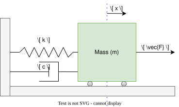

.. date: 23/03/2026
   author: Andre' Neto
   copyright: Copyright 2017 F4E | European Joint Undertaking for ITER and
   the Development of Fusion Energy ('Fusion for Energy').
   Licensed under the EUPL, Version 1.1 or - as soon they will be approved
   by the European Commission - subsequent versions of the EUPL (the "Licence")
   You may not use this work except in compliance with the Licence.
   You may obtain a copy of the Licence at: http://ec.europa.eu/idabc/eupl
   warning: Unless required by applicable law or agreed to in writing, 
   software distributed under the Licence is distributed on an "AS IS"
   basis, WITHOUT WARRANTIES OR CONDITIONS OF ANY KIND, either express
   or implied. See the Licence permissions and limitations under the Licence.

Development of a MARTe2 Application - Mass-spring-damper 
========================================================

In this section, you will develop your first MARTe2 applications based on a mass-spring-damper example.

The mass-spring-damper system is a fundamental mechanical system that consists of a mass (:math:`m`) attached to a spring with stiffness (:math:`k`) and a damper with damping coefficient (:math:`c`). The system is subjected to an external force (:math:`F`) and can be described by the following second-order ordinary differential equation:

.. math::
   m \ddot{x} + c \dot{x} + k x = F

Where:

- :math:`x` is the displacement of the mass from its equilibrium position.

- :math:`\dot{x}` is the velocity of the mass.

- :math:`\ddot{x}` is the acceleration of the mass. 

- :math:`F` is the external force applied to the mass.

- :math:`m` is the mass.

- :math:`c` is the damping coefficient.

- :math:`k` is the spring stiffness.

   Schematic representation of the mass-spring-damper system. The goal is to control the displacement (x) of the mass by adjusting the external force (F) applied to it.

The main objective of this tutorial is to identify and integrate from existing MARTe2 components the ones that can be used to implement a controller for the mass-spring-damper system, including features that can facilitate the debugging and monitoring of the system.

.. toctree::
   :maxdepth: 1
   :caption: Contents:

   mass_spring_1
   mass_spring_2
   mass_spring_3

