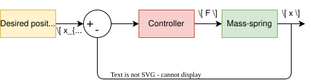
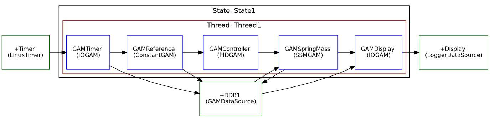

.. date: 23/03/2026
   author: Andre' Neto
   copyright: Copyright 2017 F4E | European Joint Undertaking for ITER and
   the Development of Fusion Energy ('Fusion for Energy').
   Licensed under the EUPL, Version 1.1 or - as soon as they will be approved
   by the European Commission - subsequent versions of the EUPL (the "Licence")
   You may not use this work except in compliance with the Licence.
   You may obtain a copy of the Licence at: http://ec.europa.eu/idabc/eupl
   warning: Unless required by applicable law or agreed to in writing, 
   software distributed under the Licence is distributed on an "AS IS"
   basis, WITHOUT WARRANTIES OR CONDITIONS OF ANY KIND, either express
   or implied. See the Licence permissions and limitations under the Licence.

Basic application
=================

In this section, you will implement a simple control strategy for the mass-spring-damper system using MARTe2 components. The control strategy will be based on a PID controller that adjusts the external force (:math:`F`) applied to the mass based on the error between the desired position and the actual position of the mass.

   Schematic representation of the mass-spring-damper system control system. 

The first step is to identify the main components required for the control of the mass-spring-damper system and map them to existing MARTe2 components. The main components are:

- Desired position: This component represents the target position for the mass. 
- Controller: This component implements the control logic that calculates the external force (:math:`F`) based on the error between the desired position and the actual position of the mass.
- Mass-spring: This component represents the physical system of the mass-spring-damper and simulates its dynamics based on the applied force.
- Monitoring: This component allows monitoring the system's behaviour, such as the actual position of the mass and the applied force.

The following parameters are common to all the examples in this tutorial:

- Mass (:math:`m`): 1 kg
- Damping coefficient (:math:`c`): 0.5 Ns/m
- Spring stiffness (:math:`k`): 10 N/m
- Initial position of the mass: 0 m
- Initial velocity of the mass: 0 m/s
- Sampling time: 0.01 s

In this example, the system will be controlled to maintain a constant position. The desired position will be set to a fixed value, and the controller will adjust the force to keep the mass at that position.

Application architecture
------------------------

The selected components are:

- Desired position: :vcisdoxygenmccl:`ConstantGAM`

.. literalinclude:: /_static/tutorial/Configurations/MassSpring/RTApp-MassSpring-1.cfg
   :language: c++
   :lines: 29-38
   :caption: Constant GAM configuration. Outputs a signal with the name ReferencePosition. The value is set with the parameter ``Default``.
   :linenos: 
   :emphasize-lines: 4, 7

- Controller: :vcisdoxygenmccl:`PIDGAM`. The controller takes as input the desired position (ReferencePosition) and the actual position of the mass (Position) and produces as output the control force (Force).

.. literalinclude:: /_static/tutorial/Configurations/MassSpring/RTApp-MassSpring-1.cfg
   :language: c++
   :lines: 39-70
   :caption: PIDGAM configuration. 
   :linenos: 
   :emphasize-lines: 3-5,7,11,17,25

- Mass-spring: :vcisdoxygenmccl:`SSMGAM`. The SSMGAM implements the spring-mass-damper system dynamics using a state-space representation. The input is the control force (Force) and the outputs are the position (Position) and velocity (Velocity) of the mass, as well as the internal states (not used in this application).

.. literalinclude:: /_static/tutorial/Configurations/MassSpring/RTApp-MassSpring-1.cfg
   :language: c++
   :lines: 71-103
   :caption: SSMGAM configuration. 
   :linenos: 
   :emphasize-lines: 3-5,10,16,20

- Monitoring: :vcisdoxygenmccl:`LoggerDataSource` to log all the signals.

- GAMTimer: :vcisdoxygenmccl:`IOGAM`. Triggers the execution of the thread at a fixed rate of 100 Hz, which corresponds to the sampling time of 0.01 s.

.. literalinclude:: /_static/tutorial/Configurations/MassSpring/RTApp-MassSpring-1.cfg
   :language: c++
   :lines: 5-28
   :caption: GAMTimer configuration. 
   :linenos: 
   :emphasize-lines: 9

   Schematic representation of the mass-spring-damper system MARTe2 configuration. 

.. note::

   The ``Position`` signal provided to the ``Controller GAM`` is connected to the ``Position`` output of the ``MassSpring GAM``. Due to the execution semantics of MARTe2, this value corresponds to the output computed during the previous time step. 
   
   As a result, the controller effectively operates on the delayed signal :math:`\text{Position}[k-1]`, introducing an implicit unit delay :math:`z^{-1}` in the feedback path.

   This scheme is commonly used in MARTe2 configurations. By default, the initial value of the delayed signal is set to zero; however, it can be explicitly initialised using the ``Default`` parameter of the signal.

Running the application
-----------------------

Start the application with:

.. code-block:: bash

    ./MARTeApp.sh -f ../Configurations/MassSpring/RTApp-MassSpring-1.cfg -l RealTimeLoader -s State1

Once the application is running, inspect the ``screen`` output and verify that the log shows the Position signal converging to the desired reference position (which is set to 2 m in this example):

.. code-block:: console

   $ [Information - LoggerBroker.cpp:152]: Time [0:0]:28890000
   $ [Information - LoggerBroker.cpp:152]: ReferencePosition [0:0]:2.000000
   $ [Information - LoggerBroker.cpp:152]: Position [0:0]:2.000000
   $ [Information - LoggerBroker.cpp:152]: Velocity [0:0]:0
   $ [Information - LoggerBroker.cpp:152]: Force [0:0]:20.000000

    ...

Exercises
---------

Ex. 1: Modify the reference position
------------------------------------

1. Edit the file ``../Configurations/MassSpring/RTApp-MassSpring-2.cfg`` and modify the ReferencePosition to ``3.1`` m.
2. Verify the output of the Position in the logger.
3. Why does the Position not converge to the new reference position?

.. code-block:: bash

    ./MARTeApp.sh -f ../Configurations/MassSpring/RTApp-MassSpring-2.cfg -l RealTimeLoader -s State1

.. dropdown:: Solution
   :icon: key

   The solution is to modify the ``Default`` property of the signal in the ``ConstantGAM`` output.

   .. literalinclude:: /_static/tutorial/Configurations/MassSpring/RTApp-MassSpring-2-solution.cfg
      :language: c++
      :lines: 29-38
      :caption: ConstantGAM configuration. 
      :linenos: 
      :emphasize-lines: 7

   The reason why the Position does not converge to the new reference position is that the output of the controller is limited to ``30`` N. Modify this parameter to e.g. ``40`` N in the ``PIDGAM`` configuration to allow the controller to apply a larger force and reach the new reference position.

   .. literalinclude:: /_static/tutorial/Configurations/MassSpring/RTApp-MassSpring-2-solution.cfg
      :language: c++
      :lines: 39-48
      :caption: PIDGAM configuration. 
      :linenos: 
      :emphasize-lines: 8